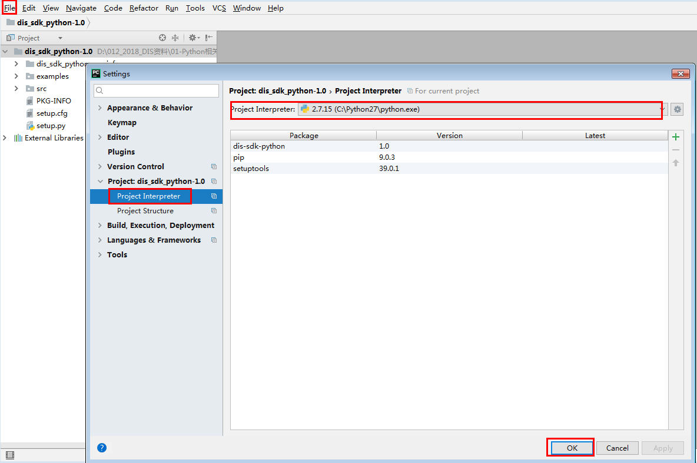

# 配置样例工程

[SDK下载](SDK下载.md)的“huaweicloud-sdk-dis-python-_X.X.X_.zip ”最新版本压缩包中提供了示例工程，您可以在本地设备上使用开发工具（如PyCharm）编译运行示例工程。或以示例工程为基础开发您的应用。示例工程代码路径：\[$path\]\\huaweicloud-sdk-dis-python-X.X.X\\dis\_sdk\_python-X.X\\dis\_sdk\_python\\examples。

## 操作步骤

1.  获取“huaweicloud-sdk-dis-python-_X.X.X_.zip ”压缩包（无需解压），在当前压缩包的目录下，打开cmd，输入**pip install**  huaweicloud-sdk-dis-python-_X.X.X_.zip。
2.  导入pycharm项目。
    1.  打开pycharm。选择“File \> open“弹出“Open File or Project“窗口。
    2.  选择本地（可通过环境变量去查找）python安装目录下的“\\Lib\\site-packages \\dis\_sdk\_python”样例工程的存储位置。（安装之后若未找到dis\_sdk\_python，请尝试升级pip，重新安装该压缩包）
    3.  单击“OK“完成项目导入。

3.  配置sdk\_python工程。

    1.  在左侧导航栏中选择“File  \>   Settings  \>   Editor  \>   Font“  ，设置字体背景色等
    2.  在左侧导航栏中选择“File  \>   Settings  \>     \>   Project Interpreter““， 添加Python。

    1.  选取合适的project Interpreter，单击“ok“。

    **图 1**  添加python  
    

    1.  在左侧导航栏中选择“File  \>   Settings  \>   Editor  \>   File Encodings“， 设置pycharm编码。

        Global Encoding、Project Encoding和Default encoding for properties files分别设置为UTF-8。

