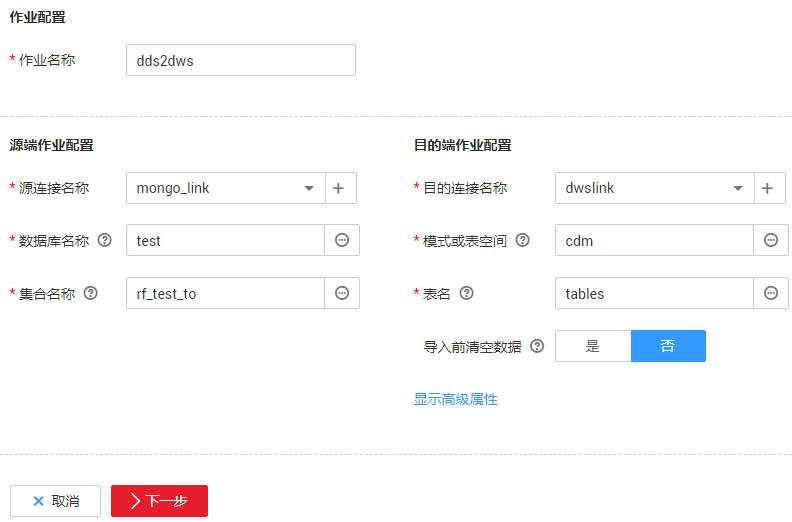

# 云上从DDS数据迁移到DWS

## 操作场景

CDM支持迁移文档数据库服务（Document Database Service，简称DDS）的数据到其他数据源，这里以数据仓库服务（Data Warehouse Service，简称DWS）为例，介绍如何使用CDM将DDS数据迁移到DWS，流程如下：

1.  [创建CDM集群并绑定EIP](#zh-cn_topic_0108275326_section459563891734)
2.  [创建DDS连接](#zh-cn_topic_0108275326_section1241410274356)
3.  [创建DWS连接](#zh-cn_topic_0108275326_section6526141353915)
4.  [创建迁移作业](#zh-cn_topic_0108275326_section18225563716)

## 前提条件

-   已购买DWS/DDS。
-   已获取DWS/DDS数据库的IP地址、端口、数据库名称、用户名、密码，且该用户拥有DWS/DDS数据库的读、写和删除权限。

## 创建CDM集群并绑定EIP

1.  创建CDM集群，具体操作请参见[创建集群](创建集群.md)。关键配置如下：
    -   CDM集群的规格，按待迁移的数据量选择，一般选择cdm.medium即可，满足大部分迁移场景。
    -   如果DDS和DWS属于相同的VPC，则创建CDM集群时选择同一个VPC，不用绑定EIP。子网、安全组可以选择与其中一个（DDS或DWS）集群的保持一致，再配置安全组规则允许CDM集群访问另一个服务（DWS或DDS）的集群。
    -   如果DDS和DWS不在同一个VPC，则创建CDM集群时选择与DDS相同的VPC，再将CDM集群[绑定EIP](解绑-绑定集群的EIP.md)，CDM通过EIP访问DWS集群。

2.  CDM集群创建完成后，选择集群操作列的“绑定弹性IP“，CDM通过EIP访问DWS。如果DDS与DWS在同一个VPC，则不用为CDM集群绑定EIP。

    > **说明：**   
    >如果用户对本地数据源的访问通道做了SSL加密，则CDM无法通过弹性IP连接数据源。  

## 创建DDS连接

1.  单击CDM集群后的“作业管理“，进入作业管理界面，再选择“连接管理  \>  新建连接“，进入选择连接器类型的界面，如[图1](#zh-cn_topic_0108275298_fig13640155194015)所示。

    **图 1**  选择连接器类型  
    

2.  创建DDS连接时，连接器类型选择“文档数据库服务（DDS）“，然后单击“下一步“配置连接参数，参数说明如[表1](#zh-cn_topic_0108275326_table175391627103516)所示。

    **表 1**  DDS连接参数

    
    <table><thead align="left"><tr id="zh-cn_topic_0108275326_row15539127163517"><th class="cellrowborder" valign="top" width="23.849999999999998%" id="mcps1.2.4.1.1">
参数名

    </th>
    <th class="cellrowborder" valign="top" width="47.79%" id="mcps1.2.4.1.2">
说明

    </th>
    <th class="cellrowborder" valign="top" width="28.360000000000003%" id="mcps1.2.4.1.3">
取值样例

    </th>
    </tr>
    </thead>
    <tbody><tr id="zh-cn_topic_0108275326_row14539102783514"><td class="cellrowborder" valign="top" width="23.849999999999998%" headers="mcps1.2.4.1.1 ">
名称

    </td>
    <td class="cellrowborder" valign="top" width="47.79%" headers="mcps1.2.4.1.2 ">
根据连接的数据源，用户自定义便于记忆、区分的连接名称。

    </td>
    <td class="cellrowborder" valign="top" width="28.360000000000003%" headers="mcps1.2.4.1.3 ">
mongo_link

    </td>
    </tr>
    <tr id="zh-cn_topic_0108275326_row13539162718359"><td class="cellrowborder" valign="top" width="23.849999999999998%" headers="mcps1.2.4.1.1 ">
Mongodb服务器列表

    </td>
    <td class="cellrowborder" valign="top" width="47.79%" headers="mcps1.2.4.1.2 ">
DDS集群的地址列表，输入格式为“数据库服务器域名或IP地址：端口”。多个服务器列表间以“;”分隔。

    </td>
    <td class="cellrowborder" valign="top" width="28.360000000000003%" headers="mcps1.2.4.1.3 ">
192.168.0.1:7300;192.168.0.2:7301

    </td>
    </tr>
    <tr id="zh-cn_topic_0108275326_row3539527113518"><td class="cellrowborder" valign="top" width="23.849999999999998%" headers="mcps1.2.4.1.1 ">
数据库名称

    </td>
    <td class="cellrowborder" valign="top" width="47.79%" headers="mcps1.2.4.1.2 ">
要连接的DDS数据库名称。

    </td>
    <td class="cellrowborder" valign="top" width="28.360000000000003%" headers="mcps1.2.4.1.3 ">
DB_mongodb

    </td>
    </tr>
    <tr id="zh-cn_topic_0108275326_row353916274356"><td class="cellrowborder" valign="top" width="23.849999999999998%" headers="mcps1.2.4.1.1 ">
用户名

    </td>
    <td class="cellrowborder" valign="top" width="47.79%" headers="mcps1.2.4.1.2 ">
登录DDS数据库的用户名。

    </td>
    <td class="cellrowborder" valign="top" width="28.360000000000003%" headers="mcps1.2.4.1.3 ">
cdm

    </td>
    </tr>
    <tr id="zh-cn_topic_0108275326_row1153952716353"><td class="cellrowborder" valign="top" width="23.849999999999998%" headers="mcps1.2.4.1.1 ">
密码

    </td>
    <td class="cellrowborder" valign="top" width="47.79%" headers="mcps1.2.4.1.2 ">
登录DDS数据库的密码。

    </td>
    <td class="cellrowborder" valign="top" width="28.360000000000003%" headers="mcps1.2.4.1.3 ">
-

    </td>
    </tr>
    </tbody>
    </table>

3.  单击“保存“回到连接管理界面。

## 创建DWS连接

1.  在“连接管理“界面单击“新建连接“，连接器类型选择“数据仓库服务（DWS）“。
2.  单击“下一步“配置DWS连接参数，必填参数如[表2](#zh-cn_topic_0108275298_table385644710314)所示，可选参数保持默认即可。

    **表 2**  DWS连接参数

    
    <table><thead align="left"><tr id="zh-cn_topic_0108275298_row19841847103118"><th class="cellrowborder" valign="top" width="21.39%" id="mcps1.2.4.1.1">
参数名

    </th>
    <th class="cellrowborder" valign="top" width="46.01%" id="mcps1.2.4.1.2">
说明

    </th>
    <th class="cellrowborder" valign="top" width="32.6%" id="mcps1.2.4.1.3">
取值样例

    </th>
    </tr>
    </thead>
    <tbody><tr id="zh-cn_topic_0108275298_row20841154712312"><td class="cellrowborder" valign="top" width="21.39%" headers="mcps1.2.4.1.1 ">
名称

    </td>
    <td class="cellrowborder" valign="top" width="46.01%" headers="mcps1.2.4.1.2 ">
输入便于记忆和区分的连接名称。

    </td>
    <td class="cellrowborder" valign="top" width="32.6%" headers="mcps1.2.4.1.3 ">
dwslink

    </td>
    </tr>
    <tr id="zh-cn_topic_0108275298_row19841194733113"><td class="cellrowborder" valign="top" width="21.39%" headers="mcps1.2.4.1.1 ">
数据库服务器

    </td>
    <td class="cellrowborder" valign="top" width="46.01%" headers="mcps1.2.4.1.2 ">
DWS数据库的IP地址或域名。

    </td>
    <td class="cellrowborder" valign="top" width="32.6%" headers="mcps1.2.4.1.3 ">
192.168.0.3

    </td>
    </tr>
    <tr id="zh-cn_topic_0108275298_row984144713312"><td class="cellrowborder" valign="top" width="21.39%" headers="mcps1.2.4.1.1 ">
端口

    </td>
    <td class="cellrowborder" valign="top" width="46.01%" headers="mcps1.2.4.1.2 ">
DWS数据库的端口。

    </td>
    <td class="cellrowborder" valign="top" width="32.6%" headers="mcps1.2.4.1.3 ">
8000

    </td>
    </tr>
    <tr id="zh-cn_topic_0108275298_row11841547133120"><td class="cellrowborder" valign="top" width="21.39%" headers="mcps1.2.4.1.1 ">
数据库名称

    </td>
    <td class="cellrowborder" valign="top" width="46.01%" headers="mcps1.2.4.1.2 ">
DWS数据库的名称。

    </td>
    <td class="cellrowborder" valign="top" width="32.6%" headers="mcps1.2.4.1.3 ">
db_demo

    </td>
    </tr>
    <tr id="zh-cn_topic_0108275298_row16841114716310"><td class="cellrowborder" valign="top" width="21.39%" headers="mcps1.2.4.1.1 ">
用户名

    </td>
    <td class="cellrowborder" valign="top" width="46.01%" headers="mcps1.2.4.1.2 ">
拥有DWS数据库的读、写和删除权限的用户。

    </td>
    <td class="cellrowborder" valign="top" width="32.6%" headers="mcps1.2.4.1.3 ">
dbadmin

    </td>
    </tr>
    <tr id="zh-cn_topic_0108275298_row98411347163117"><td class="cellrowborder" valign="top" width="21.39%" headers="mcps1.2.4.1.1 ">
密码

    </td>
    <td class="cellrowborder" valign="top" width="46.01%" headers="mcps1.2.4.1.2 ">
用户的密码。

    </td>
    <td class="cellrowborder" valign="top" width="32.6%" headers="mcps1.2.4.1.3 ">
-

    </td>
    </tr>
    <tr id="zh-cn_topic_0108275298_row128561847143117"><td class="cellrowborder" valign="top" width="21.39%" headers="mcps1.2.4.1.1 ">
导入模式

    </td>
    <td class="cellrowborder" valign="top" width="46.01%" headers="mcps1.2.4.1.2 ">
创建DWS连接时，可选择数据导入DWS的模式：<ul id="zh-cn_topic_0108275298_zh-cn_topic_0108275292_ul1142321620106"><li>COPY模式：将源数据经过DWS管理节点后拷贝到数据节点。如果需要通过Internet访问DWS，只能使用COPY模式。</li><li>GDS模式：DWS的数据节点并发从CDM实例的GDS（General Data Service）组件请求数据并写入DWS，从DWS导出数据时不支持GDS模式。</li></ul>
    

    
理论上，GDS模式比COPY模式效率高，但是使用GDS模式时，需要在VPC上修改安全组配置：修改CDM集群所在的安全组规则，允许DWS数据节点访问CDM集群内网IP的25000端口。

    </td>
    <td class="cellrowborder" valign="top" width="32.6%" headers="mcps1.2.4.1.3 ">
COPY

    </td>
    </tr>
    </tbody>
    </table>

3.  单击“保存“完成创建连接。

## 创建迁移作业

1.  选择“表/文件迁移  \>  新建作业“，开始创建数据迁移任务。

    **图 2**  创建DDS到DWS的迁移任务  
    

2.  配置作业基本信息：
    -   作业名称：输入便于记忆、区分的作业名称。
    -   源端作业配置
        -   源连接名称：选择[创建DDS连接](#zh-cn_topic_0108275326_section1241410274356)中的“mongo\_link“。
        -   数据库名称：选择待迁移数据的数据库。
        -   集合名称：DDS中MongoDB的集合，类似于关系型数据库中的表名。

    -   目的端作业配置
        -   目的连接名称：选择[创建DWS连接](#zh-cn_topic_0108275326_section6526141353915)中的连接“dwslink“。
        -   模式或表空间：选择待写入数据的DWS数据库。
        -   表名：待写入数据的表名，可以手动输入一个不存在表名，CDM会在DWS中自动创建该表。
        -   导入前清空数据：任务启动前，是否清除目的表中数据，用户可根据实际需要选择。

3.  单击“下一步“进入字段映射界面，CDM会自动匹配源端和目的端的数据表字段，需用户检查字段映射关系是否正确。

    -   如果字段映射关系不正确，用户单击字段所在行选中后，按住鼠标左键可拖拽字段来调整映射关系。
    -   导入到DWS时需要手动选择DWS的分布列，建议按如下顺序选取：
        1.  有主键可以使用主键作为分布列。
        2.  多个数据段联合做主键的场景，建议设置所有主键作为分布列。
        3.  在没有主键的场景下，如果没有选择分布列，DWS会默认第一列作为分布列，可能会有数据倾斜风险。

    -   如果需要转换源端字段内容，可在该步骤配置，具体操作请参见[字段转换](字段转换.md)，这里选择不进行字段转换。

    **图 3**  字段映射1  
    

4.  单击“下一步“配置任务参数，一般情况下全部保持默认即可。

    该步骤用户可以配置如下可选功能：

    -   作业失败重试：如果作业执行失败，可选择是否自动重试，这里保持默认值“不重试“。
    -   作业分组：选择作业所属的分组，默认分组为“DEFAULT“。在CDM“作业管理“界面，支持作业分组显示、按组批量启动作业、按分组导出作业等操作。
    -   是否定时执行：如果需要配置作业定时自动执行，请参见[配置定时任务](配置定时任务.md)。这里保持默认值“否“。
    -   抽取并发数：设置同时执行的抽取任务数。这里保持默认值“1“。
    -   是否写入脏数据：如果需要将作业执行过程中处理失败的数据、或者被清洗过滤掉的数据写入OBS中，以便后面查看，可通过该参数配置，写入脏数据前需要先配置好OBS连接。这里保持默认值“否“即可，不记录脏数据。
    -   作业运行完是否删除：这里保持默认值“不删除“。

5.  单击“保存并运行“，回到作业管理界面，在作业管理界面可查看作业执行进度和结果。
6.  作业执行成功后，单击作业操作列的“历史记录“，可查看该作业的历史执行记录、读取和写入的统计数据。

    在历史记录界面单击“日志“，可查看作业的日志信息。

