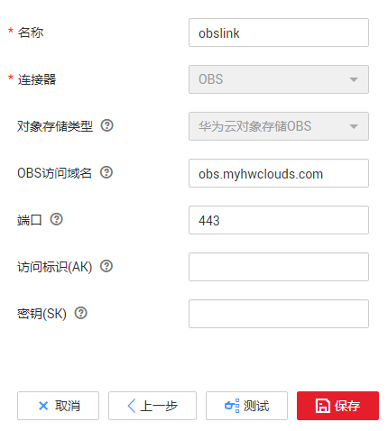
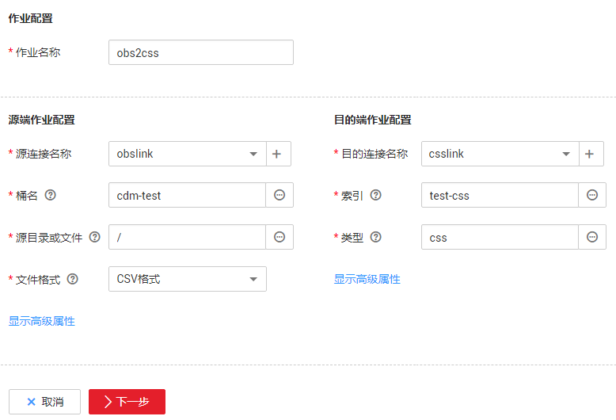

# 云上从OBS数据迁移到云搜索服务

## 操作场景

CDM支持在云上各服务之间相互迁移数据，本章节介绍如何通过CDM将数据从OBS迁移到云搜索服务中，流程如下：

1.  [创建CDM集群](#zh-cn_topic_0123434187_section2178135115010)
2.  [创建云搜索服务连接](#zh-cn_topic_0123434187_section1770203514912)
3.  [创建OBS连接](#zh-cn_topic_0123434187_section4967189141012)
4.  [创建迁移作业](#zh-cn_topic_0123434187_section4397112121511)

## 前提条件

-   已获取OBS的访问域名、端口，以及AK、SK。
-   已经开通了云搜索服务，且获取云搜索服务集群的IP地址和端口。

## 创建CDM集群

创建CDM集群，具体操作请参见[创建集群](创建集群.md)。关键配置如下：

-   CDM集群的规格，按待迁移的数据量选择，一般选择cdm.medium即可，满足大部分迁移场景。
-   CDM集群的VPC必须和云搜索服务集群所在VPC一致，且推荐子网、安全组也与云搜索服务一致。
-   如果安全控制原因不能使用相同子网和安全组，那么需要确保安全组规则能允许CDM访问云搜索服务集群。

## 创建云搜索服务连接

1.  单击CDM集群后的“作业管理“，进入作业管理界面，再选择“连接管理  \>  新建连接“，进入选择连接器类型的界面，如[图1](#zh-cn_topic_0108275437_zh-cn_topic_0108275298_fig13640155194015)所示。

    **图 1**  选择连接器类型  
    

2.  连接器类型选择“云搜索服务“后单击“下一步“，配置云搜索服务连接参数。

    -   名称：用户自定义连接名称，例如“csslink“。
    -   Elasticsearch服务器列表：配置为云搜索服务集群的连接地址、端口，格式为“ip:port“，多个地址之间使用分号（；）分隔，例如192.168.0.1:9200;192.168.0.2:9200。
    -   用户名、密码：配置为访问云搜索服务集群的用户，需要拥有数据库的读写权限。

    **图 2**  创建云搜索服务连接  
    

3.  单击“保存“回到连接管理界面。

## 创建OBS连接

1.  在连接管理界面单击“新建连接“，连接器类型选择“对象存储服务（OBS）“后，单击“下一步“配置OBS连接参数。

    -   名称：用户自定义连接名称，例如“obslink“。
    -   OBS服务器、端口：配置为OBS实际的地址信息。
    -   访问标识（AK）、密钥（SK）：登录OBS的AK、SK。

    **图 3**  创建OBS连接  
    

2.  单击“保存“回到连接管理界面。

## 创建迁移作业

1.  选择“表/文件迁移  \>  新建作业“，开始创建从OBS导出数据到云搜索服务的任务。

    **图 4**  创建OBS到云搜索服务的迁移任务  
    

    -   作业名称：用户自定义便于记忆、区分的任务名称。
    -   源端作业配置
        -   源连接名称：选择[创建OBS连接](#zh-cn_topic_0123434187_section4967189141012)中的“obslink“。
        -   桶名：待迁移数据的桶。
        -   源目录或文件：待迁移数据的路径，也可以迁移桶下的所有目录、文件。
        -   文件格式：迁移文件到数据表时，文件格式选择“CSV格式“。
        -   高级属性里的可选参数一般情况下保持默认既可，详细说明请参见[配置对象存储源端参数](配置对象存储源端参数.md)。

    -   目的端作业配置
        -   目的连接名称：选择[创建云搜索服务连接](#zh-cn_topic_0123434187_section1770203514912)中的“csslink“。
        -   索引：待写入数据的Elasticsearch索引，也可以输入一个新的索引，CDM会自动在云上搜索服务中创建。
        -   类型：待写入数据的Elasticsearch类型，可输入新的类型，CDM支持在目的端自动创建类型。
        -   高级属性里的可选参数一般情况下保持默认既可，详细说明请参见[配置Elasticsearch或云搜索服务目的端参数](配置Elasticsearch或云搜索服务目的端参数.md)。

2.  单击“下一步“进入字段映射界面，CDM会自动匹配源和目的字段，如[图5](#zh-cn_topic_0108275437_fig68696231445)所示。

    -   如果字段映射顺序不匹配，可通过拖拽字段调整。
    -   如果选择在目的端自动创建类型，这里还需要配置每个类型的字段类型、字段名称。
    -   CDM支持迁移过程中转换字段内容，详细参见[字段转换](字段转换.md)。

    **图 5**  云搜索服务的字段映射  
    

3.  单击“下一步“配置任务参数，一般情况下全部保持默认即可。

    该步骤用户可以配置如下可选功能：

    -   作业失败重试：如果作业执行失败，可选择是否自动重试，这里保持默认值“不重试“。
    -   作业分组：选择作业所属的分组，默认分组为“DEFAULT“。在CDM“作业管理“界面，支持作业分组显示、按组批量启动作业、按分组导出作业等操作。
    -   是否定时执行：如果需要配置作业定时自动执行，请参见[配置定时任务](配置定时任务.md)。这里保持默认值“否“。
    -   抽取并发数：设置同时执行的抽取任务数。这里保持默认值“1“。
    -   是否写入脏数据：如果需要将作业执行过程中处理失败的数据、或者被清洗过滤掉的数据写入OBS中，以便后面查看，可通过该参数配置，写入脏数据前需要先配置好OBS连接。这里保持默认值“否“即可，不记录脏数据。
    -   作业运行完是否删除：这里保持默认值“不删除“。

4.  单击“保存并运行“，回到作业管理界面，在作业管理界面可查看作业执行进度和结果。
5.  作业执行成功后，单击作业操作列的“历史记录“，可查看该作业的历史执行记录、读取和写入的统计数据。

    在历史记录界面单击“日志“，可查看作业的日志信息。

