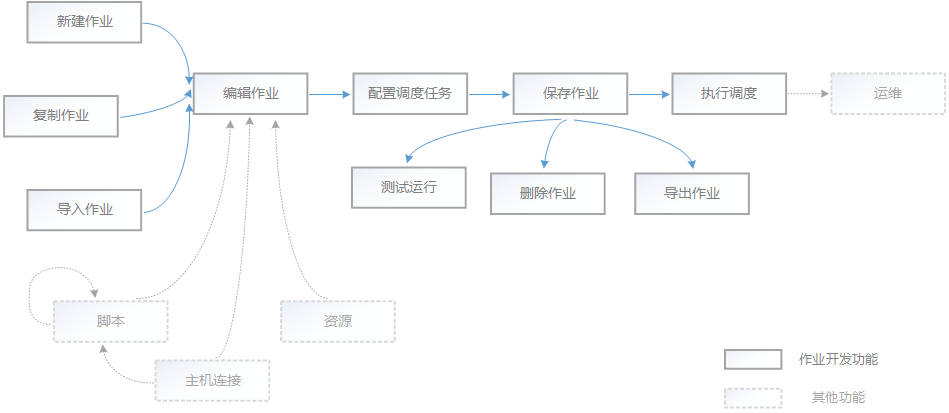

# 作业开发概述

开发作业前，您可以通过[图1](#zh-cn_topic_0155308177_fig1161314581225)了解DLF作业开发的基本流程。

**图 1**  作业开发流程  

-   **新建作业**

    提供两种作业类型：批处理和实时处理，分别应用于批量数据处理和实时连接性数据处理。具体请参见[新建作业](新建作业.md)。

-   **复制作业**

    复制已有的作业进行开发，具体请参见[复制作业](复制作业.md)

-   **导入作业**

    从本地导入ZIP格式的作业文件，该文件从DLF作业中导出，您可以使用编辑器修改文件中的配置信息。具体请参见[导出导入作业](导出导入作业.md)。

-   **编辑作业**

    根据业务需求编排和配置节点，具体请参见[开发作业](开发作业.md)。

-   **配置调度任务**
    -   如果您的作业是批处理作业，您可以配置作业级别的调度任务，即以作业为一整体进行调度，支持单次调度、周期调度、事件驱动调度三种调度方式。具体请参见[配置作业调度任务](开发作业.md#zh-cn_topic_0099797007_section1590152794714)。
    -   如果您的作业是实时处理作业，您可以配置节点级别的调度任务，即每一个节点可以独立调度，支持单次调度、周期调度、事件驱动调度三种调度方式。具体请参见[配置节点调度任务](开发作业.md#zh-cn_topic_0099797007_section644754422910)。

-   **保存作业**

    及时保存作业，防止作业配置信息丢失。具体请参见[保存和启动作业](开发作业.md#zh-cn_topic_0099797007_section1267113200395)。

-   **测试运行**

    在作业开发页面手动触发作业运行，您可以在画布下方查看运行过程和结果，该功能主要用于调试作业。

-   **删除作业**

    及时删除不再使用的作业，减少资源和配额的占用，支持同时删除多个作业。具体请参见[删除作业](删除作业.md)。

-   **导出作业**

    如需备份或分享作业时，您可以导出作业文件到本地。具体请参见[导出导入作业](导出导入作业.md)。

-   **执行调度**

    作业开发完成后，通过**执行调度**来启动作业。

