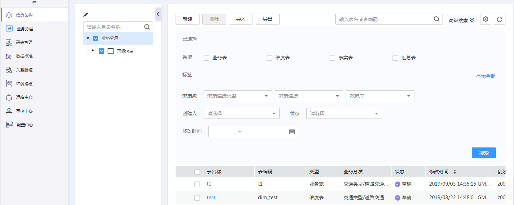

# 信息架构

信息架构是以结构化的方式描述在业务运作和管理决策中所需要的各类信息及其关系的一套整体组件规范。在规范设计的“信息架构”页面，可以查看和管理所有的表，包括业务表、维度表、事实表、汇总表等资源。

## 信息架构概览

1.  [登录DAYU控制台](https://console.huaweicloud.com/dayu/)，找到所需要的DAYU实例，单击实例卡片上的“进入控制台”，进入概览页面。

    选择“空间管理”页签，完成工作空间的创建。

    在工作空间列表中，找到所需要的工作空间。

1.  单击相应工作空间的“规范设计“。

    系统跳转至规范设计的“信息架构”页面。

    **图 1**  信息架构  
    

    信息架构页面的左侧是业务分层导航树，右侧是信息架构列表。

2.  在信息架构页面，可以执行以下操作：
    -   **搜索**

        在信息架构列表上方，设置表名、类型、数据源等筛选条件，然后单击“搜索”可以查找指定的表，单击表名称，可以进入表的详情页面，查看表的详细信息。

        找到指定的表后，可以对表执行以下操作：

        -   编辑
        -   发布
        -   更多 \> 下线
        -   更多 \> 预览SQL
        -   更多 \> 发布日志

    -   **新建**

        单击“新建”，可以新建业务表、事实表和汇总表。创建的过程可以参见[关系建模](关系建模.md)、[新建事实表](新建事实表.md)、[新建汇总表](新建汇总表.md)。

    -   **导入**

        单击“导入”，可以导入业务表，下载表导入模板，填写模板并上传，然后单击“确定“。

    -   **导出**

        单击“导出”，可以导出业务表的模型或DDL。

