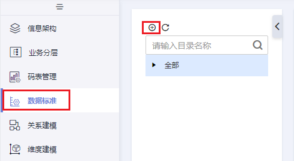
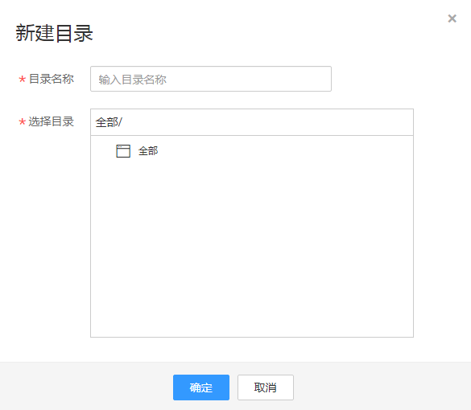
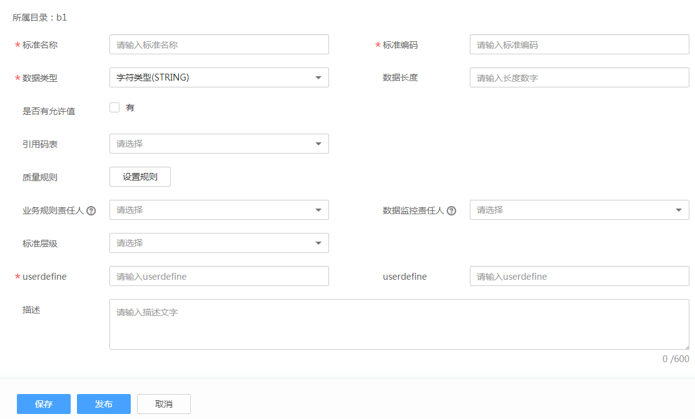

# 制定数据标准

数据标准是用于描述公司层面需共同遵守的数据含义和业务规则，它描述了公司层面对某个数据的共同理解，这些理解一旦确定下来，就应作为企业层面的标准在企业内被共同遵守。

数据标准，也称数据元，由一组属性规定其定义、标识、表示和允许值的数据单元，是不可再分的最小数据单元。您可以将数据标准关联到各个业务上的数据库中。其中，标识符、数据类型、表示格式、值域是数据交换的基础，它们用于描述表的字段元信息，规范字段所存储的数据信息。

本章节介绍如何创建数据标准，创建好的数据标准，可用于在关系建模中新建业务表时与业务表中的字段相关联，从而约束业务表中的字段遵从指定的数据标准。

## 新建数据标准目录

1.  [登录DAYU控制台](https://console.huaweicloud.com/dayu/)，找到所需要的DAYU实例，单击实例卡片上的“进入控制台”，进入概览页面。

    选择“空间管理”页签，完成工作空间的创建。

    在工作空间列表中，找到所需要的工作空间。

1.  单击相应工作空间的“规范设计“。
2.  在规范设计页面，单击左侧导航树中的“数据标准“。
3.  首次进入数据标准页面，会显示制定数据标准模板的页面，如下图所示，在“可选项”中勾选所需要的选项，单击按钮可以添加自定义项，完成后单击“确定“。

    **图 1**  数据标准模板  
    

    保存模板后，如需修改，您也可以进入“配置中心 \> 标准模板管理”页面修改模板，详情请参见[配置数据标准模板](配置中心.md#zh-cn_topic_0189687297_section1936343520116)。在新建数据标准时，将需要设置此处模板中选中的选项。

4.  在“数据标准“页面，单击按钮新建目录，如下图所示。

    **图 2**  数据标准页面  
    

5.  在弹出窗口中配置如下参数，然后单击“确定“。

    **图 3**  新建数据标准目录  
    

    **表 1**  参数描述

    
    <table><thead align="left"><tr id="zh-cn_topic_0189641496_row1667010516314"><th class="cellrowborder" valign="top" width="19.96%" id="mcps1.2.3.1.1">
参数名称

    </th>
    <th class="cellrowborder" valign="top" width="80.04%" id="mcps1.2.3.1.2">
说明

    </th>
    </tr>
    </thead>
    <tbody><tr id="zh-cn_topic_0189641496_row76702511632"><td class="cellrowborder" valign="top" width="19.96%" headers="mcps1.2.3.1.1 ">
目录名称

    </td>
    <td class="cellrowborder" valign="top" width="80.04%" headers="mcps1.2.3.1.2 ">
只能包含中文、英文字母、数字和下划线。

    </td>
    </tr>
    <tr id="zh-cn_topic_0189641496_row7670195110319"><td class="cellrowborder" valign="top" width="19.96%" headers="mcps1.2.3.1.1 ">
选择目录

    </td>
    <td class="cellrowborder" valign="top" width="80.04%" headers="mcps1.2.3.1.2 ">
在已有的目录中选择一个目录，新建的目录将创建在所选择的目录中。

    </td>
    </tr>
    </tbody>
    </table>

## 新建数据标准

1.  在“数据标准“页面的目录树中，单击一个指定目录，然后单击“新建“按钮新建一个数据标准。
2.  在新建数据标准页面中，配置如下参数（此处只会显示在数据标准模板中选择的参数选项），然后单击“发布“。

    **图 4**  新建数据标准  
    

    **表 2**  数据标准参数说明

    
    <table><thead align="left"><tr id="zh-cn_topic_0189641496_row197762036123115"><th class="cellrowborder" valign="top" width="19.96%" id="mcps1.2.3.1.1">
参数名称

    </th>
    <th class="cellrowborder" valign="top" width="80.04%" id="mcps1.2.3.1.2">
说明

    </th>
    </tr>
    </thead>
    <tbody><tr id="zh-cn_topic_0189641496_row27761336103113"><td class="cellrowborder" valign="top" width="19.96%" headers="mcps1.2.3.1.1 ">
*标准名称

    </td>
    <td class="cellrowborder" valign="top" width="80.04%" headers="mcps1.2.3.1.2 ">
数据标准的中文名称。只能包含中文、英文字母、数字、左右括号、空格和下划线，且以中文或英文字母开头。

    </td>
    </tr>
    <tr id="zh-cn_topic_0189641496_row677633619314"><td class="cellrowborder" valign="top" width="19.96%" headers="mcps1.2.3.1.1 ">
*标准编码

    </td>
    <td class="cellrowborder" valign="top" width="80.04%" headers="mcps1.2.3.1.2 ">
数据标准的英文名称。只能包含英文字母、数字、左右括号、空格和下划线，且以英文字母开头。

    </td>
    </tr>
    <tr id="zh-cn_topic_0189641496_row135291059122711"><td class="cellrowborder" valign="top" width="19.96%" headers="mcps1.2.3.1.1 ">
*数据类型

    </td>
    <td class="cellrowborder" valign="top" width="80.04%" headers="mcps1.2.3.1.2 ">
数据类型有：STRING、BIGINT、DOUBLE、TIMESTAMP、DATE、BOOLEAN、DECIMAL。

    
不同的系统数据类型可能存在差异，系统内部会做类型转换。

    </td>
    </tr>
    <tr id="zh-cn_topic_0189641496_row21151471282"><td class="cellrowborder" valign="top" width="19.96%" headers="mcps1.2.3.1.1 ">
数据长度

    </td>
    <td class="cellrowborder" valign="top" width="80.04%" headers="mcps1.2.3.1.2 ">
可以为空，或者输入0~10000之间的数值。数据长度为空时，对数据长度不做限制。

    </td>
    </tr>
    <tr id="zh-cn_topic_0189641496_row145356136286"><td class="cellrowborder" valign="top" width="19.96%" headers="mcps1.2.3.1.1 ">
是否有允许值

    </td>
    <td class="cellrowborder" valign="top" width="80.04%" headers="mcps1.2.3.1.2 ">
当勾选时，请输入允许值。输入一个值并按回车即可添加一个允许值，支持添加多个允许值，最多支持20个。

    </td>
    </tr>
    <tr id="zh-cn_topic_0189641496_row01160176285"><td class="cellrowborder" valign="top" width="19.96%" headers="mcps1.2.3.1.1 ">
引用码表

    </td>
    <td class="cellrowborder" valign="top" width="80.04%" headers="mcps1.2.3.1.2 ">
选择已创建的码表并选择相应的“码表字段”，这样就可以将码表字段和数据标准相关联。

    </td>
    </tr>
    <tr id="zh-cn_topic_0189641496_row14252101011283"><td class="cellrowborder" valign="top" width="19.96%" headers="mcps1.2.3.1.1 ">
质量规则

    </td>
    <td class="cellrowborder" valign="top" width="80.04%" headers="mcps1.2.3.1.2 ">
单击“设置规则”进行设置。

    </td>
    </tr>
    <tr id="zh-cn_topic_0189641496_row1970695516281"><td class="cellrowborder" valign="top" width="19.96%" headers="mcps1.2.3.1.1 ">
业务规则责任人

    </td>
    <td class="cellrowborder" valign="top" width="80.04%" headers="mcps1.2.3.1.2 ">
-

    </td>
    </tr>
    <tr id="zh-cn_topic_0189641496_row2573162132917"><td class="cellrowborder" valign="top" width="19.96%" headers="mcps1.2.3.1.1 ">
数据监控责任人

    </td>
    <td class="cellrowborder" valign="top" width="80.04%" headers="mcps1.2.3.1.2 ">
-

    </td>
    </tr>
    <tr id="zh-cn_topic_0189641496_row498615852814"><td class="cellrowborder" valign="top" width="19.96%" headers="mcps1.2.3.1.1 ">
标准层级

    </td>
    <td class="cellrowborder" valign="top" width="80.04%" headers="mcps1.2.3.1.2 ">
global：表示全局级别。

    </td>
    </tr>
    <tr id="zh-cn_topic_0189641496_row1578653953215"><td class="cellrowborder" valign="top" width="19.96%" headers="mcps1.2.3.1.1 ">
描述

    </td>
    <td class="cellrowborder" valign="top" width="80.04%" headers="mcps1.2.3.1.2 ">
描述信息。支持的长度0~600字符。

    </td>
    </tr>
    </tbody>
    </table>

3.  完成数据标准的创建和发布之后，需要等待审核人员审核。

    审核通过后，数据标准就建好了。返回“数据标准”页面，在列表中可以查看建好的数据标准。

## 导入数据标准

1.  在规范设计页面，单击左侧的“数据标准“，进入数据标准页面。
2.  在数据标准的目录树中，单击一个指定的目录名称，然后单击“导入“，弹出对话框，如下图所示。

    **图 5**  导入数据标准  
    

3.  单击“下载数据标准导入模板”下载模板。打开模板，请根据业务需求填写好模板中的相关参数并保存。

    模板中的参数说明如下表所示，其中名称前带“\*”的参数为必填参数，名称前未带“\*”的参数为可选参数。

    **表 3**  数据标准参数说明

    
    <table><thead align="left"><tr id="row1594614271482"><th class="cellrowborder" valign="top" width="19.96%" id="mcps1.2.3.1.1">
参数名称

    </th>
    <th class="cellrowborder" valign="top" width="80.04%" id="mcps1.2.3.1.2">
说明

    </th>
    </tr>
    </thead>
    <tbody><tr id="row19946142744814"><td class="cellrowborder" valign="top" width="19.96%" headers="mcps1.2.3.1.1 ">
*标准名称

    </td>
    <td class="cellrowborder" valign="top" width="80.04%" headers="mcps1.2.3.1.2 ">
数据标准的中文名称。只能包含中文、英文字母、数字、左右括号、空格和下划线，且以中文或英文字母开头。

    </td>
    </tr>
    <tr id="row2946182764818"><td class="cellrowborder" valign="top" width="19.96%" headers="mcps1.2.3.1.1 ">
*标准编码

    </td>
    <td class="cellrowborder" valign="top" width="80.04%" headers="mcps1.2.3.1.2 ">
数据标准的英文名称。只能包含英文字母、数字、左右括号、空格和下划线，且以英文字母开头。

    </td>
    </tr>
    <tr id="row6946182710487"><td class="cellrowborder" valign="top" width="19.96%" headers="mcps1.2.3.1.1 ">
*数据类型

    </td>
    <td class="cellrowborder" valign="top" width="80.04%" headers="mcps1.2.3.1.2 ">
数据类型有：STRING、BIGINT、DOUBLE、TIMESTAMP、DATE、BOOLEAN、DECIMAL。

    
不同的系统数据类型可能存在差异，系统内部会做类型转换。

    </td>
    </tr>
    <tr id="row19947627144818"><td class="cellrowborder" valign="top" width="19.96%" headers="mcps1.2.3.1.1 ">
数据长度

    </td>
    <td class="cellrowborder" valign="top" width="80.04%" headers="mcps1.2.3.1.2 ">
可以为空，或者输入0~10000之间的数值。数据长度为空时，对数据长度不做限制。

    </td>
    </tr>
    <tr id="row49471327104815"><td class="cellrowborder" valign="top" width="19.96%" headers="mcps1.2.3.1.1 ">
是否有允许值

    </td>
    <td class="cellrowborder" valign="top" width="80.04%" headers="mcps1.2.3.1.2 ">
true表示有允许值，false表示没有允许值。

    </td>
    </tr>
    <tr id="row1637218512494"><td class="cellrowborder" valign="top" width="19.96%" headers="mcps1.2.3.1.1 ">
允许值

    </td>
    <td class="cellrowborder" valign="top" width="80.04%" headers="mcps1.2.3.1.2 ">
当参数“是否有允许值”为true时，必须设置“允许值”。

    
支持添加多个允许值，最多支持20个。多个允许值之间以逗号分隔，例如“1,2,3”。

    </td>
    </tr>
    <tr id="row1394712784817"><td class="cellrowborder" valign="top" width="19.96%" headers="mcps1.2.3.1.1 ">
引用码表

    </td>
    <td class="cellrowborder" valign="top" width="80.04%" headers="mcps1.2.3.1.2 ">
填写已创建的码表名称。

    </td>
    </tr>
    <tr id="row208089715551"><td class="cellrowborder" valign="top" width="19.96%" headers="mcps1.2.3.1.1 ">
码表字段

    </td>
    <td class="cellrowborder" valign="top" width="80.04%" headers="mcps1.2.3.1.2 ">
当“引用码表”不为空时，请设置该引用码表中的“码表字段”，这样就可以将码表字段和数据标准相关联。

    </td>
    </tr>
    <tr id="row594710279488"><td class="cellrowborder" valign="top" width="19.96%" headers="mcps1.2.3.1.1 ">
质量规则

    </td>
    <td class="cellrowborder" valign="top" width="80.04%" headers="mcps1.2.3.1.2 ">
暂不支持设置，您可以在完成数据标准的导入后，再进入“规范设计 &gt; 数据标准”页面，编辑相应的数据标准，设置质量规则。

    </td>
    </tr>
    <tr id="row894712717483"><td class="cellrowborder" valign="top" width="19.96%" headers="mcps1.2.3.1.1 ">
业务规则责任人

    </td>
    <td class="cellrowborder" valign="top" width="80.04%" headers="mcps1.2.3.1.2 ">
填写业务规则责任人的账号或IAM用户名。

    </td>
    </tr>
    <tr id="row19471127154818"><td class="cellrowborder" valign="top" width="19.96%" headers="mcps1.2.3.1.1 ">
数据监控责任人

    </td>
    <td class="cellrowborder" valign="top" width="80.04%" headers="mcps1.2.3.1.2 ">
填写数据监控责任人的账号或IAM用户名。

    </td>
    </tr>
    <tr id="row17947132754817"><td class="cellrowborder" valign="top" width="19.96%" headers="mcps1.2.3.1.1 ">
标准层级

    </td>
    <td class="cellrowborder" valign="top" width="80.04%" headers="mcps1.2.3.1.2 ">
global：表示全局级别。

    </td>
    </tr>
    <tr id="row12947132724812"><td class="cellrowborder" valign="top" width="19.96%" headers="mcps1.2.3.1.1 ">
描述

    </td>
    <td class="cellrowborder" valign="top" width="80.04%" headers="mcps1.2.3.1.2 ">
描述信息。支持的长度0~600字符。

    </td>
    </tr>
    <tr id="row290683817571"><td class="cellrowborder" valign="top" width="19.96%" headers="mcps1.2.3.1.1 ">
用户自定义字段

    </td>
    <td class="cellrowborder" valign="top" width="80.04%" headers="mcps1.2.3.1.2 ">
用户可以在数据标准中添加一个或多个自定义字段。

    </td>
    </tr>
    </tbody>
    </table>

4.  返回“导入数据标准”对话框，选择上一步配置好的数据标准模板文件，然后单击“上传并校验“。

    如果上传的模板文件校验不通过，请修改正确后，再重新上传。

5.  单击“确定“完成数据标准的导入。

## 导出数据标准

1.  在规范设计页面，单击左侧的“数据标准“，进入数据标准页面。
2.  在数据标准的目录树中，单击一个指定的目录名称，然后单击“导出“。
3.  在导出对话框中，单击“确定“即可导出指定目录下的所有数据标准。

