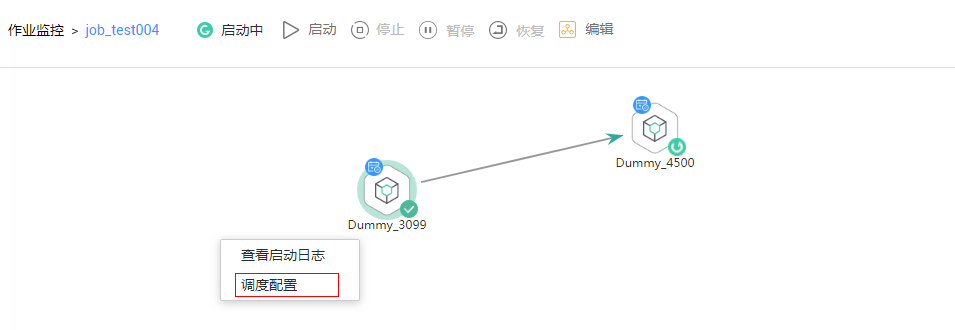
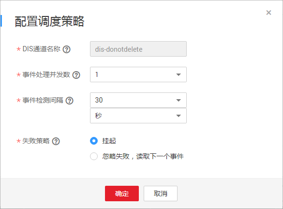
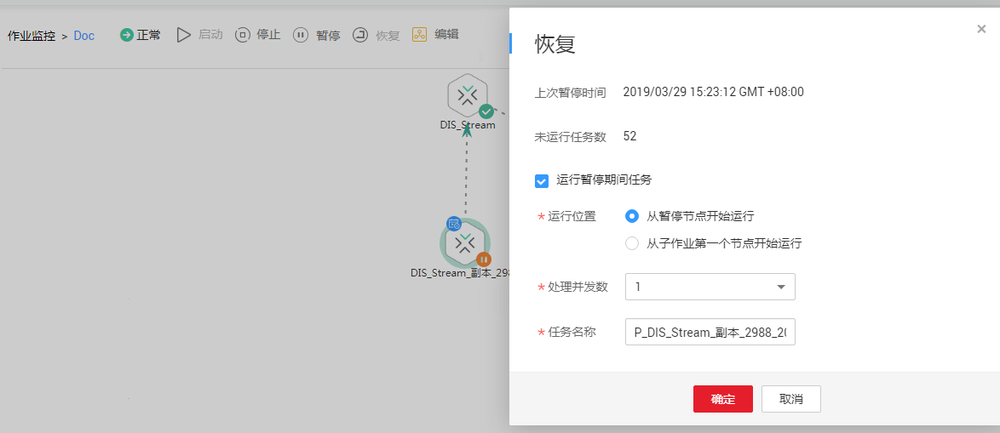

# 实时作业监控

用户可以在“实时作业监控“页面查看实时处理作业的运行状态、开始执行时间、结束执行时间等信息，以及启动和停止实时处理作业。

**图 1**  实时作业监控  

-   批量处理作业：勾选作业名称前的复选框，单击“启动“/“停止“
-   查看作业的节点信息：单击作业名称，在打开的页面中查看该作业的节点连接关系，以及节点的监控信息。
-   查看最近实例状态：单击作业名称前的下拉箭头，均可查看最近的实例状态。

## 实时作业：节点配置事件驱动调度

当您配置的实时作业中某个节点配置有事件驱动调度时，在打开的页面中右键单击配置有事件驱动调度的节点，选择“调度配置“，可以查看和修改节点的调度信息。

1.  在数据开发主界面的左侧导航栏，选择“运维调度  \>  作业监控“。
2.  选择“实时作业监控“页签，单击作业名称。
3.  单击配置有事件驱动调度的节点，选择“调度配置“。配置如[表1](#zh-cn_topic_0159097444_table49281014413)所示的参数。

    选择“查看启动日志“时，可以查看作业启动时的日志信息。

    **图 2**  调度配置  
    

    当节点“事件驱动调度“的“触发事件类型“配置为“DIS“时：

    **图 3**  DIS调度策略配置  
    

    **表 1**  调度配策略参数说明

    
    <table><thead align="left"><tr id="zh-cn_topic_0159097444_row199212108418"><th class="cellrowborder" valign="top" width="35.17%" id="mcps1.2.3.1.1">
参数

    </th>
    <th class="cellrowborder" valign="top" width="64.83%" id="mcps1.2.3.1.2">
说明

    </th>
    </tr>
    </thead>
    <tbody><tr id="zh-cn_topic_0159097444_row2924101943"><td class="cellrowborder" valign="top" width="35.17%" headers="mcps1.2.3.1.1 ">
DIS通道名称

    </td>
    <td class="cellrowborder" valign="top" width="64.83%" headers="mcps1.2.3.1.2 ">
选择DIS通道，当指定的DIS通道有新消息时，DLF将新消息传递给作业，触发该作业运行。

    </td>
    </tr>
    <tr id="zh-cn_topic_0159097444_row139313103416"><td class="cellrowborder" valign="top" width="35.17%" headers="mcps1.2.3.1.1 ">
事件处理并发数

    </td>
    <td class="cellrowborder" valign="top" width="64.83%" headers="mcps1.2.3.1.2 ">
选择作业并行处理的数量，最大并发数为10。

    </td>
    </tr>
    <tr id="zh-cn_topic_0159097444_row20242201857"><td class="cellrowborder" valign="top" width="35.17%" headers="mcps1.2.3.1.1 ">
事件检测间隔

    </td>
    <td class="cellrowborder" valign="top" width="64.83%" headers="mcps1.2.3.1.2 ">
配置时间间隔，检测DIS通道是否有新的消息。时间间隔单位可以配置为秒或分钟。

    </td>
    </tr>
    <tr id="zh-cn_topic_0159097444_row99381018417"><td class="cellrowborder" valign="top" width="35.17%" headers="mcps1.2.3.1.1 ">
失败策略

    </td>
    <td class="cellrowborder" valign="top" width="64.83%" headers="mcps1.2.3.1.2 ">
选择调度失败后的策略：

    <ul id="zh-cn_topic_0159097444_ul69311102418"><li>结束调度</li><li>忽略失败，继续调度</li></ul>
    </td>
    </tr>
    </tbody>
    </table>

## 实时作业暂停后重新运行

当您配置的实时作业中某个节点配置有事件调度时，您可以对这个节点配置“禁用“后恢复运行，恢复运行时可以重新选择运行位置 。

1.  在数据开发主界面的左侧导航栏，选择“运维调度  \>  作业监控“。
2.  选择“实时作业监控“页签，单击作业名称。
3.  在“作业监控“页面，单击配置有事件调度的节点，选择“禁用“。
4.  设置禁用后，再右键单击选择“恢复“。弹出“恢复“对话框，配置如[表2](#zh-cn_topic_0159097444_table3326856465)所示的参数。

    **图 4**  恢复操作  
    

    **表 2**  恢复参数说明

    
    <table><thead align="left"><tr id="zh-cn_topic_0159097444_row3326205194619"><th class="cellrowborder" valign="top" width="35.17%" id="mcps1.2.3.1.1">
参数

    </th>
    <th class="cellrowborder" valign="top" width="64.83%" id="mcps1.2.3.1.2">
说明

    </th>
    </tr>
    </thead>
    <tbody><tr id="zh-cn_topic_0159097444_row032775174611"><td class="cellrowborder" valign="top" width="35.17%" headers="mcps1.2.3.1.1 ">
上次暂停时间

    </td>
    <td class="cellrowborder" valign="top" width="64.83%" headers="mcps1.2.3.1.2 ">
节点暂停运行的起始时间。

    </td>
    </tr>
    <tr id="zh-cn_topic_0159097444_row83271359463"><td class="cellrowborder" valign="top" width="35.17%" headers="mcps1.2.3.1.1 ">
未运行任务数

    </td>
    <td class="cellrowborder" valign="top" width="64.83%" headers="mcps1.2.3.1.2 ">
节点暂停期间没有运行的任务数量。

    </td>
    </tr>
    <tr id="zh-cn_topic_0159097444_row83279584615"><td class="cellrowborder" colspan="2" valign="top" headers="mcps1.2.3.1.1 mcps1.2.3.1.2 ">
“运行暂停期间任务”的参数

    </td>
    </tr>
    <tr id="zh-cn_topic_0159097444_row137888187485"><td class="cellrowborder" valign="top" width="35.17%" headers="mcps1.2.3.1.1 ">
运行位置

    </td>
    <td class="cellrowborder" valign="top" width="64.83%" headers="mcps1.2.3.1.2 ">
选择节点暂停运行后，恢复运行时的启动位置。

    <ul id="zh-cn_topic_0159097444_ul3377183914814"><li>从暂停节点开始运行</li><li>从子作业第一个节点开始运行</li></ul>
    </td>
    </tr>
    <tr id="zh-cn_topic_0159097444_row14252202320486"><td class="cellrowborder" valign="top" width="35.17%" headers="mcps1.2.3.1.1 ">
处理并发数

    </td>
    <td class="cellrowborder" valign="top" width="64.83%" headers="mcps1.2.3.1.2 ">
选择任务处理的数量。

    </td>
    </tr>
    <tr id="zh-cn_topic_0159097444_row9675415184815"><td class="cellrowborder" valign="top" width="35.17%" headers="mcps1.2.3.1.1 ">
任务名称

    </td>
    <td class="cellrowborder" valign="top" width="64.83%" headers="mcps1.2.3.1.2 ">
恢复的任务名称。

    </td>
    </tr>
    </tbody>
    </table>

