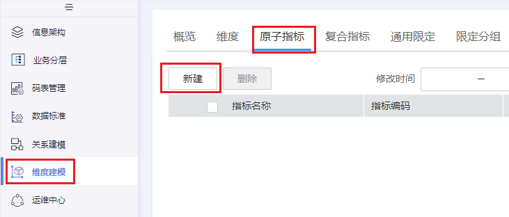
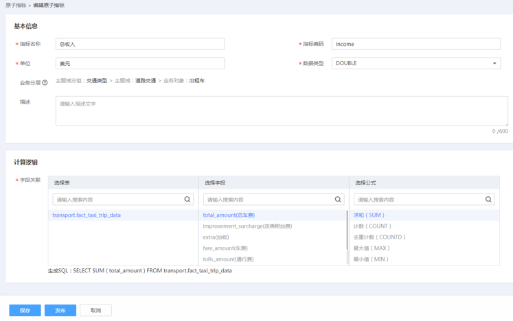

# 新建原子指标

原子指标是对指标统计逻辑、具体算法的一个抽象。为了从根源上解决定义、研发不一致的问题，指标定义明确设计统计逻辑（即计算逻辑），不需要ETL二次或者重复研发，从而提升了研发效率，也保证了统计结果的一致性。

## 背景信息

原子指标的来源逻辑表：

-   原子指标是为了构建应用统计分析所需的复合指标，而定义的数据组件，因此只可以基于事实逻辑表明细数据表来创建。
-   复合指标无来源表，它归属于每个组合成它的原始的原子指标的来源表。

原子指标与复合指标的关系：

-   原子指标的计算逻辑修改生效后，会直接更新应用于相关的复合指标。
-   原子指标被删除或者变更英文名，需要校验下游是否有复合指标使用，如果有，则无法删除或变更。
-   原子指标的数据类型更改会影响下游复合指标。

## 新建原子指标并发布

1.  [登录DAYU控制台](https://console.huaweicloud.com/dayu/)，找到所需要的DAYU实例，单击实例卡片上的“进入控制台”，进入概览页面。

    选择“空间管理”页签，完成工作空间的创建。

    在工作空间列表中，找到所需要的工作空间。

1.  单击相应工作空间的“规范设计“。

    系统跳转至规范设计页面。

1.  在规范设计页面，单击左侧导航树中的“维度建模“，选择“原子指标“页签，然后单击“新建“按钮，开始新建原子指标。

    **图 1**  原子指标页面1  
    

2.  如下图所示配置参数，然后单击“发布“。

    **图 2**  新建原子指标  
    

    **表 1**  新建原子指标参数说明

    
    <table><thead align="left"><tr id="zh-cn_topic_0169427298_row67041151113819"><th class="cellrowborder" valign="top" width="15.83%" id="mcps1.2.3.1.1">
参数名称

    </th>
    <th class="cellrowborder" valign="top" width="84.17%" id="mcps1.2.3.1.2">
说明

    </th>
    </tr>
    </thead>
    <tbody><tr id="zh-cn_topic_0169427298_row177048511387"><td class="cellrowborder" valign="top" width="15.83%" headers="mcps1.2.3.1.1 ">
指标名称

    </td>
    <td class="cellrowborder" valign="top" width="84.17%" headers="mcps1.2.3.1.2 ">
只能包含中文、英文字母、数字和下划线，且以中文或英文字母开头。

    </td>
    </tr>
    <tr id="zh-cn_topic_0169427298_row0704205115382"><td class="cellrowborder" valign="top" width="15.83%" headers="mcps1.2.3.1.1 ">
指标编码

    </td>
    <td class="cellrowborder" valign="top" width="84.17%" headers="mcps1.2.3.1.2 ">
只能包含英文字母、数字和下划线，且以英文字母开头。

    </td>
    </tr>
    <tr id="zh-cn_topic_0169427298_row770415183811"><td class="cellrowborder" valign="top" width="15.83%" headers="mcps1.2.3.1.1 ">
单位

    </td>
    <td class="cellrowborder" valign="top" width="84.17%" headers="mcps1.2.3.1.2 ">
例如小时、人等。输入不能为空。

    </td>
    </tr>
    <tr id="zh-cn_topic_0169427298_row970410514385"><td class="cellrowborder" valign="top" width="15.83%" headers="mcps1.2.3.1.1 ">
数据类型

    </td>
    <td class="cellrowborder" valign="top" width="84.17%" headers="mcps1.2.3.1.2 ">
根据下拉框选择对应的数据类型。

    </td>
    </tr>
    <tr id="zh-cn_topic_0169427298_row1370495193819"><td class="cellrowborder" valign="top" width="15.83%" headers="mcps1.2.3.1.1 ">
业务分层

    </td>
    <td class="cellrowborder" valign="top" width="84.17%" headers="mcps1.2.3.1.2 ">
显示所属的业务分层信息。

    </td>
    </tr>
    <tr id="zh-cn_topic_0169427298_row16704151163813"><td class="cellrowborder" valign="top" width="15.83%" headers="mcps1.2.3.1.1 ">
描述

    </td>
    <td class="cellrowborder" valign="top" width="84.17%" headers="mcps1.2.3.1.2 ">
描述信息。支持的长度0~600字符。

    </td>
    </tr>
    <tr id="zh-cn_topic_0169427298_row1323271916444"><td class="cellrowborder" valign="top" width="15.83%" headers="mcps1.2.3.1.1 ">
字段关联

    </td>
    <td class="cellrowborder" valign="top" width="84.17%" headers="mcps1.2.3.1.2 ">
根据实际情况选择所需要事实表的字段进行关联，然后选择合适的计算公式。

    
根据您的选择，系统将显示生成的SQL语句。

    </td>
    </tr>
    </tbody>
    </table>

3.  在弹出框中单击“确认提交”，提交审核。
4.  （可选）参考[3](#li1262015374262)\~[5](#li15620337182610)的步骤，完成其他原子指标的发布。
5.  等待审核人员审核。

    审核通过后，原子指标就创建好了。

## 管理原子指标

1.  在规范设计页面，单击左侧导航树中的“维度建模“，选择“原子指标“页签，进入原子指标页面。

    **图 3**  原子指标页面2  
    

2.  您可以根据实际需要选择如下操作。

    
    <table><thead align="left"><tr id="zh-cn_topic_0169427298_row167461051211"><th class="cellrowborder" valign="top" width="37.9%" id="mcps1.1.3.1.1">
当需要...

    </th>
    <th class="cellrowborder" valign="top" width="62.1%" id="mcps1.1.3.1.2">
则...

    </th>
    </tr>
    </thead>
    <tbody><tr id="zh-cn_topic_0169427298_row1674695011"><td class="cellrowborder" valign="top" width="37.9%" headers="mcps1.1.3.1.1 ">
新建

    </td>
    <td class="cellrowborder" valign="top" width="62.1%" headers="mcps1.1.3.1.2 ">
执行<a href="#zh-cn_topic_0169427298_section2012674313338">新建原子指标并发布</a>。

    </td>
    </tr>
    <tr id="zh-cn_topic_0169427298_row137468516113"><td class="cellrowborder" valign="top" width="37.9%" headers="mcps1.1.3.1.1 ">
编辑

    </td>
    <td class="cellrowborder" valign="top" width="62.1%" headers="mcps1.1.3.1.2 ">
执行<a href="#li2054015512277">3</a>。

    </td>
    </tr>
    <tr id="zh-cn_topic_0169427298_row1746651110"><td class="cellrowborder" valign="top" width="37.9%" headers="mcps1.1.3.1.1 ">
发布

    </td>
    <td class="cellrowborder" valign="top" width="62.1%" headers="mcps1.1.3.1.2 ">
执行<a href="#li1354145162717">4</a>。

    </td>
    </tr>
    <tr id="zh-cn_topic_0169427298_row195105118312"><td class="cellrowborder" valign="top" width="37.9%" headers="mcps1.1.3.1.1 ">
下线

    </td>
    <td class="cellrowborder" valign="top" width="62.1%" headers="mcps1.1.3.1.2 ">
执行<a href="#li65410542714">5</a>。

    </td>
    </tr>
    <tr id="zh-cn_topic_0169427298_row9597213538"><td class="cellrowborder" valign="top" width="37.9%" headers="mcps1.1.3.1.1 ">
删除

    </td>
    <td class="cellrowborder" valign="top" width="62.1%" headers="mcps1.1.3.1.2 ">
执行<a href="#li95419562710">6</a>。

    </td>
    </tr>
    </tbody>
    </table>

3.  编辑
    1.  在需要编辑的原子指标右侧，单击“编辑“，进入编辑原子指标页面。
    2.  根据实际需要编辑相关内容。
    3.  单击“发布“。如果您暂时不想发布，可以先单击“保存“，稍后再发布。

4.  发布
    1.  在需要发布的原子指标右侧，单击“发布“，弹出“提交发布“对话框。
    2.  在下拉菜单中选择审核人。
    3.  单击“确定提交“。

5.  下线
    1.  在需要下线的原子指标右侧，单击“下线“，系统弹出“提交下线“对话框。
    2.  在下拉菜单中选择审核人。
    3.  单击“确认提交“。

        > **说明：**   
        >1.  下线及删除原子指标的前提是无依赖引用，即复合指标引用。  

6.  删除
    1.  勾选需要删除的原子指标，单击左上角“删除“，系统弹出“删除“对话框。
    2.  单击“确定“。

