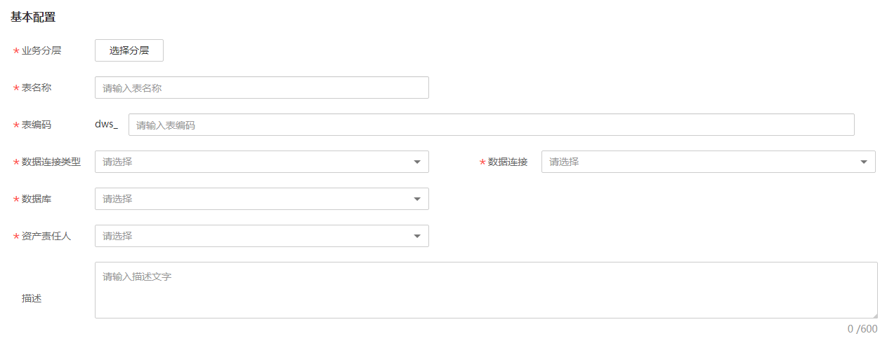

# 新建汇总表

汇总逻辑表是由一个特定的分析对象（如会员）及其相关的统计指标组成的。组成一个汇总逻辑表的统计指标都具有相同的统计粒度（如会员），汇总逻辑表面向用户提供了以统计粒度（如会员）为主题的所有统计数据（如会员主题集市）。

## 新建汇总表并发布

1.  [登录DAYU控制台](https://console.huaweicloud.com/dayu/)，找到所需要的DAYU实例，单击实例卡片上的“进入控制台”，进入概览页面。

    选择“空间管理”页签，完成工作空间的创建。

    在工作空间列表中，找到所需要的工作空间。

1.  单击相应工作空间的“规范设计“。

    系统跳转至规范设计页面。

1.  在规范设计页面，单击左侧导航树中的“维度建模“，选择“汇总表“页签，然后单击“新建“按钮，开始创建汇总表。
2.  在“新建汇总表”页面，完成如下配置：
    1.  设置“基本配置”参数：

        **图 1**  汇总表基本配置  
        

        **表 1**  基本配置参数说明

        
        <table><thead align="left"><tr id="zh-cn_topic_0172166856_row581145416366"><th class="cellrowborder" valign="top" width="17.64%" id="mcps1.2.3.1.1">
参数说明

        </th>
        <th class="cellrowborder" valign="top" width="82.36%" id="mcps1.2.3.1.2">
说明

        </th>
        </tr>
        </thead>
        <tbody><tr id="zh-cn_topic_0172166856_row08175413363"><td class="cellrowborder" valign="top" width="17.64%" headers="mcps1.2.3.1.1 ">
业务分层

        </td>
        <td class="cellrowborder" valign="top" width="82.36%" headers="mcps1.2.3.1.2 ">
单击“选择分层”，选择事实表所属的主题域分组、主题域和业务对象。

        </td>
        </tr>
        <tr id="zh-cn_topic_0172166856_row181754113610"><td class="cellrowborder" valign="top" width="17.64%" headers="mcps1.2.3.1.1 ">
表名称

        </td>
        <td class="cellrowborder" valign="top" width="82.36%" headers="mcps1.2.3.1.2 ">
设置表名称。只能包含中文、英文字母、数字和下划线，且以中文或英文字母开头。

        </td>
        </tr>
        <tr id="zh-cn_topic_0172166856_row88112541363"><td class="cellrowborder" valign="top" width="17.64%" headers="mcps1.2.3.1.1 ">
表编码

        </td>
        <td class="cellrowborder" valign="top" width="82.36%" headers="mcps1.2.3.1.2 ">
设置表英文名称。只能包含英文字母、数字和下划线，且以英文字母开头。

        </td>
        </tr>
        <tr id="zh-cn_topic_0172166856_row58119547362"><td class="cellrowborder" valign="top" width="17.64%" headers="mcps1.2.3.1.1 ">
数据连接类型

        </td>
        <td class="cellrowborder" valign="top" width="82.36%" headers="mcps1.2.3.1.2 ">
根据下拉框选择对应的数据连接类型。

        </td>
        </tr>
        <tr id="zh-cn_topic_0172166856_row781354203617"><td class="cellrowborder" valign="top" width="17.64%" headers="mcps1.2.3.1.1 ">
数据连接

        </td>
        <td class="cellrowborder" valign="top" width="82.36%" headers="mcps1.2.3.1.2 ">
根据下拉框选择对应的数据连接。

        </td>
        </tr>
        <tr id="zh-cn_topic_0172166856_row1782354103620"><td class="cellrowborder" valign="top" width="17.64%" headers="mcps1.2.3.1.1 ">
资产责任人

        </td>
        <td class="cellrowborder" valign="top" width="82.36%" headers="mcps1.2.3.1.2 ">
根据下拉框选择对应的资产责任人。

        </td>
        </tr>
        <tr id="zh-cn_topic_0172166856_row28219545362"><td class="cellrowborder" valign="top" width="17.64%" headers="mcps1.2.3.1.1 ">
描述

        </td>
        <td class="cellrowborder" valign="top" width="82.36%" headers="mcps1.2.3.1.2 ">
描述信息。支持的长度0~600字符。

        </td>
        </tr>
        </tbody>
        </table>

    2.  配置时间周期：

        **图 2**  时间周期配置  
        

    3.  在“指标配置”区域，单击“添加”可添加一个或多个已创建好的复合指标。

        **图 3**  指标配置  
        

    4.  在“维度配置”区域，单击“添加”可添加与所选指标关联的维度属性。

        **图 4**  维度配置  
        

3.  单击“发布“，并在弹出框中单击“确认提交”，提交审核。
4.  请联系审核人员审核汇总表，等待审核通过。
5.  返回“维度建模 \> 汇总表“页面，在列表中找到刚发布的汇总表，单击“更多 \> 发布日志“查看发布日志。

    表发布并通过审核后，系统会进行创建表、同步数据资产操作，通过“发布日志“可以查看流程处理的日志详情，同时可以查看操作是否成功以及处理失败的原因。

    -   如果“发布日志“显示成功，无错误日志，说明表在数据库中创建成功。
    -   如果“发布日志”中出现错误日志，说明表创建失败。

        请根据错误日志定位错误原因，问题解决后再单击“发布日志”对话框中的“重新同步“再次下发同步命令。在处理过程中，如果您有任何问题，请联系技术支持人员。

    **图 5**  发布日志1  
    

## 管理汇总表

1.  在规范设计页面，单击左侧导航树中的“维度建模“，选择“汇总表“页签，进入汇总表页面。

    **图 6**  汇总表页面  
    

2.  您可以根据实际需要选择如下操作。

    
    <table><thead align="left"><tr id="zh-cn_topic_0172166856_row167461051211"><th class="cellrowborder" valign="top" width="37.9%" id="mcps1.1.3.1.1">
当需要...

    </th>
    <th class="cellrowborder" valign="top" width="62.1%" id="mcps1.1.3.1.2">
则...

    </th>
    </tr>
    </thead>
    <tbody><tr id="zh-cn_topic_0172166856_row1674695011"><td class="cellrowborder" valign="top" width="37.9%" headers="mcps1.1.3.1.1 ">
新建

    </td>
    <td class="cellrowborder" valign="top" width="62.1%" headers="mcps1.1.3.1.2 ">
执行<a href="#zh-cn_topic_0172166856_section692617199341">新建汇总表并发布</a>。

    </td>
    </tr>
    <tr id="zh-cn_topic_0172166856_row137468516113"><td class="cellrowborder" valign="top" width="37.9%" headers="mcps1.1.3.1.1 ">
编辑

    </td>
    <td class="cellrowborder" valign="top" width="62.1%" headers="mcps1.1.3.1.2 ">
执行<a href="#li206174174312">3</a>。

    </td>
    </tr>
    <tr id="zh-cn_topic_0172166856_row1746651110"><td class="cellrowborder" valign="top" width="37.9%" headers="mcps1.1.3.1.1 ">
发布

    </td>
    <td class="cellrowborder" valign="top" width="62.1%" headers="mcps1.1.3.1.2 ">
执行<a href="#li46177173317">4</a>。

    </td>
    </tr>
    <tr id="row63245715451"><td class="cellrowborder" valign="top" width="37.9%" headers="mcps1.1.3.1.1 ">
发布日志

    </td>
    <td class="cellrowborder" valign="top" width="62.1%" headers="mcps1.1.3.1.2 ">
执行<a href="#li1561712172314">5</a>。

    </td>
    </tr>
    <tr id="zh-cn_topic_0172166856_row195105118312"><td class="cellrowborder" valign="top" width="37.9%" headers="mcps1.1.3.1.1 ">
下线

    </td>
    <td class="cellrowborder" valign="top" width="62.1%" headers="mcps1.1.3.1.2 ">
执行<a href="#li261731713110">6</a>。

    </td>
    </tr>
    <tr id="zh-cn_topic_0172166856_row9597213538"><td class="cellrowborder" valign="top" width="37.9%" headers="mcps1.1.3.1.1 ">
删除

    </td>
    <td class="cellrowborder" valign="top" width="62.1%" headers="mcps1.1.3.1.2 ">
执行<a href="#li36179177313">7</a>。

    </td>
    </tr>
    </tbody>
    </table>

3.  编辑
    1.  在需要编辑的汇总表右侧，单击“编辑“，进入编辑汇总表页面。
    2.  根据实际需要编辑相关内容。
    3.  单击“发布“。

4.  发布
    1.  在需要发布的汇总表右侧，单击“发布“，弹出“提交发布“对话框。
    2.  在下拉菜单中选择审核人。
    3.  单击“确定提交“。

5.  发布日志
    1.  在列表中找到所需要的汇总表，在右侧单击“更多 \> 发布日志“，弹出“发布日志“对话框。
    2.  如果“发布日志”中有错误日志，说明发布失败。您可以单击“重新同步“进行重试。
    3.  完成后，单击“取消“关闭窗口。

6.  下线
    1.  在需要下线的汇总表右侧，单击“下线“，系统弹出“提交下线“对话框。
    2.  在下拉菜单中选择审核人。
    3.  单击“确认提交“。

7.  删除
    1.  勾选需要删除的汇总表，单击左上角“删除“，系统弹出“删除“对话框。
    2.  单击“确定“。

