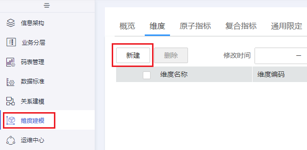
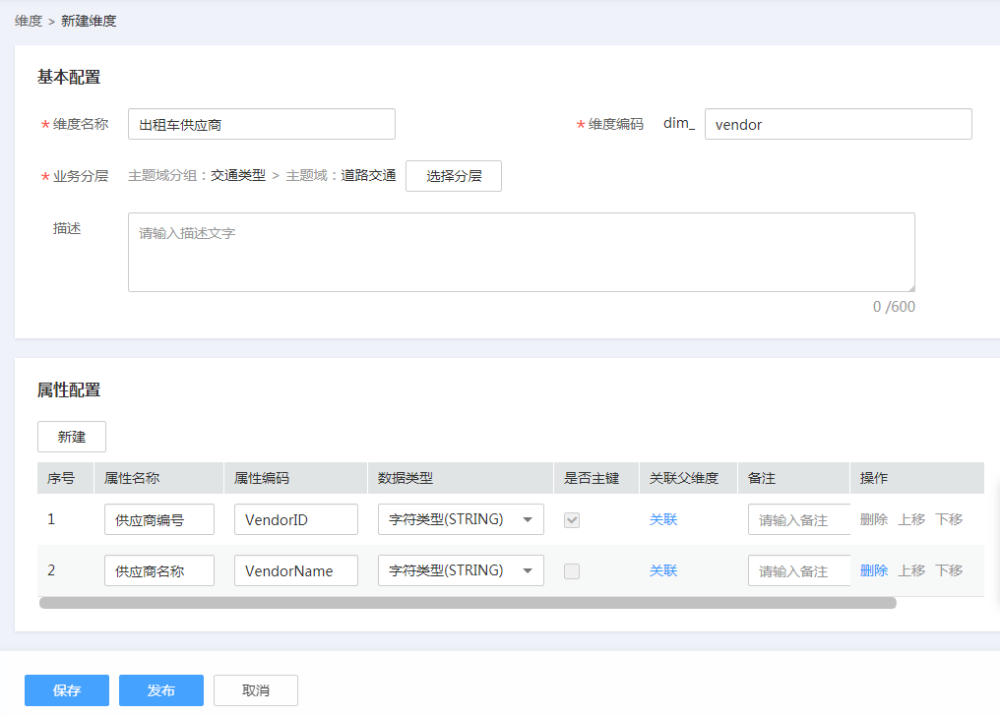
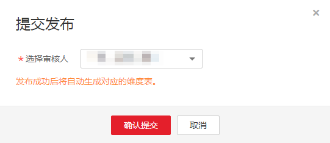
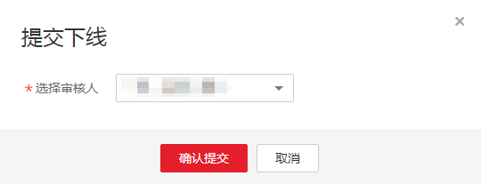

# 新建维度

维度是用于观察和分析业务数据的视角，来源于属性，并且多数具有层级结构，如：地理维度\(其中包括国家、地区、省以及城市等级别的内容\)、时间维度\(其中包括年度、季度、月度等级别的内容\)。创建维度，即从顶层规范业务中实体（或称主数据）的存在性及唯一性。

## 新建维度并发布

1.  [登录DAYU控制台](https://console.huaweicloud.com/dayu/)，找到所需要的DAYU实例，单击实例卡片上的“进入控制台”，进入概览页面。

    选择“空间管理”页签，完成工作空间的创建。

    在工作空间列表中，找到所需要的工作空间。

1.  单击相应工作空间的“规范设计“。

    系统跳转至规范设计页面。

1.  在规范设计页面，单击左侧导航树中的“维度建模“，选择“维度”页签，然后单击“新建“开始创建维度。

    **图 1**  维度建模  
    

2.  在“新建维度“页面填写“基本配置”参数，并在“属性配置”中新建相关的维度属性，然后单击“发布“。

    系统默认第一个维度属性为主键。在“属性配置”中单击“新建”按钮，可以添加多个维度属性。

    **图 2**  新建维度  
    

    **表 1**  基本配置

    
    <table><thead align="left"><tr id="zh-cn_topic_0171848089_row1667010516314"><th class="cellrowborder" valign="top" width="19.96%" id="mcps1.2.3.1.1">
参数名称

    </th>
    <th class="cellrowborder" valign="top" width="80.04%" id="mcps1.2.3.1.2">
说明

    </th>
    </tr>
    </thead>
    <tbody><tr id="zh-cn_topic_0171848089_row76702511632"><td class="cellrowborder" valign="top" width="19.96%" headers="mcps1.2.3.1.1 ">
维度名称

    </td>
    <td class="cellrowborder" valign="top" width="80.04%" headers="mcps1.2.3.1.2 ">
只能包含中文、英文字母、数字和下划线，且中文或英文字母开头。

    </td>
    </tr>
    <tr id="zh-cn_topic_0171848089_row7670195110319"><td class="cellrowborder" valign="top" width="19.96%" headers="mcps1.2.3.1.1 ">
维度编码

    </td>
    <td class="cellrowborder" valign="top" width="80.04%" headers="mcps1.2.3.1.2 ">
即维度表的名称，在创建维度时，系统将自动创建以“维度编码”名称命名的维度表。只能包含英文字母、数字和下划线，且英文字母开头。

    </td>
    </tr>
    <tr id="zh-cn_topic_0171848089_row867018514311"><td class="cellrowborder" valign="top" width="19.96%" headers="mcps1.2.3.1.1 ">
业务分层

    </td>
    <td class="cellrowborder" valign="top" width="80.04%" headers="mcps1.2.3.1.2 ">
单击“选择分层”，在弹出对话框中选择相应的业务分层，然后单击“确定”。

    </td>
    </tr>
    <tr id="zh-cn_topic_0171848089_row166721051335"><td class="cellrowborder" valign="top" width="19.96%" headers="mcps1.2.3.1.1 ">
描述

    </td>
    <td class="cellrowborder" valign="top" width="80.04%" headers="mcps1.2.3.1.2 ">
描述信息。支持的长度0~600字符。

    </td>
    </tr>
    </tbody>
    </table>

    **表 2**  属性配置

    
    <table><thead align="left"><tr id="zh-cn_topic_0171848089_row737813418517"><th class="cellrowborder" valign="top" width="20.22%" id="mcps1.2.3.1.1">
参数名称

    </th>
    <th class="cellrowborder" valign="top" width="79.78%" id="mcps1.2.3.1.2">
说明

    </th>
    </tr>
    </thead>
    <tbody><tr id="zh-cn_topic_0171848089_row10378743519"><td class="cellrowborder" valign="top" width="20.22%" headers="mcps1.2.3.1.1 ">
属性名称

    </td>
    <td class="cellrowborder" valign="top" width="79.78%" headers="mcps1.2.3.1.2 ">
只能包含中文、英文字母、数字和下划线，且中文或英文字母开头。

    </td>
    </tr>
    <tr id="zh-cn_topic_0171848089_row3379134657"><td class="cellrowborder" valign="top" width="20.22%" headers="mcps1.2.3.1.1 ">
属性编码

    </td>
    <td class="cellrowborder" valign="top" width="79.78%" headers="mcps1.2.3.1.2 ">
只能包含英文字母、数字和下划线，且英文字母开头。

    </td>
    </tr>
    <tr id="zh-cn_topic_0171848089_row1637924651"><td class="cellrowborder" valign="top" width="20.22%" headers="mcps1.2.3.1.1 ">
数据类型

    </td>
    <td class="cellrowborder" valign="top" width="79.78%" headers="mcps1.2.3.1.2 ">
根据原始数据定义数据类型。

    </td>
    </tr>
    <tr id="zh-cn_topic_0171848089_row13791148516"><td class="cellrowborder" valign="top" width="20.22%" headers="mcps1.2.3.1.1 ">
是否主键

    </td>
    <td class="cellrowborder" valign="top" width="79.78%" headers="mcps1.2.3.1.2 ">
系统默认第一个维度属性为主键。

    </td>
    </tr>
    <tr id="zh-cn_topic_0171848089_row96301557359"><td class="cellrowborder" valign="top" width="20.22%" headers="mcps1.2.3.1.1 ">
关联父维度

    </td>
    <td class="cellrowborder" valign="top" width="79.78%" headers="mcps1.2.3.1.2 ">
如果当前的维度属性与其他维度之间存在父子关系，可以单击“关联”与父维度进行关联。

    </td>
    </tr>
    <tr id="zh-cn_topic_0171848089_row796619146615"><td class="cellrowborder" valign="top" width="20.22%" headers="mcps1.2.3.1.1 ">
备注

    </td>
    <td class="cellrowborder" valign="top" width="79.78%" headers="mcps1.2.3.1.2 ">
输入维度属性的描述信息。

    </td>
    </tr>
    </tbody>
    </table>

3.  在弹出对话框中，选择审核人，单击“确认提交“，完成发布。

    **图 3**  提交发布0  
    

4.  可以参照步骤[3](#li1440412191860)\~步骤[5](#li8253174218911)，完成其他维度的创建和发布。
5.  完成所有维度的新建和发布之后，需要等待审核人员审核。

    审核通过后，维度以及维度表就建好了，我们才能进行后续操作。

    在“维度建模”页面，选择“维度表”页签，可以查看建好的维度表。但是此时维度表尚未发布，因此，接下来，我们还需要发布维度表。

## 编辑维度

1.  在规范设计页面，单击左侧导航树中的“维度建模“，进入相应页面后，选择“维度”页签。
2.  在维度列表中找到需要编辑的维度，单击“编辑“，进入编辑维度页面。
3.  根据实际需要编辑维度的相关信息。
4.  单击“保存“，保存所做的修改。或者，单击“发布“，发布修改后维度。

## 发布维度

如果新建了维度但并未发布，可以执行以下步骤发布维度：

1.  在规范设计页面，单击左侧导航树中的“维度建模“，进入相应页面后，选择“维度”页签。
2.  在维度列表中找到需要发布的维度，单击“发布“。
3.  在弹出对话框中，选择审核人，单击“确认提交“，完成发布。

    **图 4**  提交发布1  
    

## 下线维度

对于已发布的维度，可以执行以下步骤下线维度：

1.  在规范设计页面，单击左侧导航树中的“维度建模“，进入相应页面后，选择“维度”页签。
2.  在维度列表中找到需要下线的维度，单击“下线“。
3.  在弹出对话框中，选择审核人，然后单击“确认提交“，完成维度的下线。

    **图 5**  提交下线  
    

## 删除维度

如果您已不再需要某个维度，可以删除该维度。如果待删除的维度已发布，则无法执行删除操作，您必须先将该维度下线后，才能执行删除操作，具体操作请参见[下线维度](#zh-cn_topic_0171848089_section12843562212)。

1.  在规范设计页面，单击左侧导航树中的“维度建模“，进入相应页面后，选择“维度”页签。
2.  在维度列表中找到需要删除的维度，勾选该维度，然后单击维度列表上方的“删除“按钮。
3.  在系统弹出的“删除“对话框中，确认无误后，单击“确定“将维度删除。

