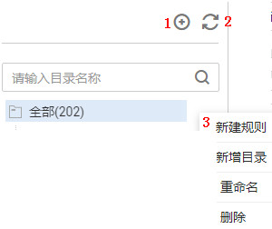

# 新建规则

管理所有业务规则，规则定义了指标间或者指标和数值间的关系，使用目录维护业务规则。

## 入口说明

基于指标创建业务规则，需要选择规则归属目录，请参见[图1](#zh-cn_topic_0141836088_fig16551015812)创建归属目录。

**图 1**  新建规则的归属目录  

**表 1**  导航栏按键说明

<table><thead align="left"><tr id="zh-cn_topic_0141836088_row352545110274"><th class="cellrowborder" valign="top" width="15.040000000000001%" id="mcps1.2.3.1.1">
序号

</th>
<th class="cellrowborder" valign="top" width="84.96000000000001%" id="mcps1.2.3.1.2">
说明

</th>
</tr>
</thead>
<tbody><tr id="zh-cn_topic_0141836088_row352525182710"><td class="cellrowborder" valign="top" width="15.040000000000001%" headers="mcps1.2.3.1.1 ">
1

</td>
<td class="cellrowborder" valign="top" width="84.96000000000001%" headers="mcps1.2.3.1.2 ">
新建目录

</td>
</tr>
<tr id="zh-cn_topic_0141836088_row55274511271"><td class="cellrowborder" valign="top" width="15.040000000000001%" headers="mcps1.2.3.1.1 ">
2

</td>
<td class="cellrowborder" valign="top" width="84.96000000000001%" headers="mcps1.2.3.1.2 ">
刷新目录

</td>
</tr>
<tr id="zh-cn_topic_0141836088_row205282051102719"><td class="cellrowborder" valign="top" width="15.040000000000001%" headers="mcps1.2.3.1.1 ">
3

</td>
<td class="cellrowborder" valign="top" width="84.96000000000001%" headers="mcps1.2.3.1.2 ">
选择全部 ，单击右键，可新建规则、新建目录、删除目录并对目录重命名。

</td>
</tr>
</tbody>
</table>

## 新建规则

1.  [登录DAYU控制台](https://console.huaweicloud.com/dayu/)，找到所需要的DAYU实例，单击实例卡片上的“进入控制台”，进入概览页面。

    选择“空间管理”页签，完成工作空间的创建。

    在工作空间列表中，找到所需要的工作空间。

1.  单击相应工作空间的“数据质量“。

    系统跳转至数据质量页面。

1.  选择“业务指标监控  \>  规则管理“。
2.  单击“新建规则“，在弹出的对话框中，参见[表2](#zh-cn_topic_0141836088_table105313428316)配置相关参数，新建规则。

    **表 2**  配置业务规则参数

    
    <table><thead align="left"><tr id="zh-cn_topic_0141836088_row553544283118"><th class="cellrowborder" valign="top" width="21.07%" id="mcps1.2.3.1.1">
参数名

    </th>
    <th class="cellrowborder" valign="top" width="78.93%" id="mcps1.2.3.1.2">
说明

    </th>
    </tr>
    </thead>
    <tbody><tr id="zh-cn_topic_0141836088_row18536164263118"><td class="cellrowborder" valign="top" width="21.07%" headers="mcps1.2.3.1.1 ">
规则名称

    </td>
    <td class="cellrowborder" valign="top" width="78.93%" headers="mcps1.2.3.1.2 ">
业务规则的名称，只能包含中文、英文字母、数字、“_”，且长度为1~64个字符。

    </td>
    </tr>
    <tr id="zh-cn_topic_0141836088_row5550175812324"><td class="cellrowborder" valign="top" width="21.07%" headers="mcps1.2.3.1.1 ">
规则描述

    </td>
    <td class="cellrowborder" valign="top" width="78.93%" headers="mcps1.2.3.1.2 ">
为更好的识别业务规则 ，此处加以描述信息。描述信息长度不能超过256个字符。

    </td>
    </tr>
    <tr id="zh-cn_topic_0141836088_row015812693317"><td class="cellrowborder" valign="top" width="21.07%" headers="mcps1.2.3.1.1 ">
规则目录

    </td>
    <td class="cellrowborder" valign="top" width="78.93%" headers="mcps1.2.3.1.2 ">
业务规则的存储目录，可选择已创建的目录。目录创建请参见<a href="#zh-cn_topic_0141836088_fig16551015812">图1</a>。

    </td>
    </tr>
    <tr id="zh-cn_topic_0141836088_row670553113316"><td class="cellrowborder" valign="top" width="21.07%" headers="mcps1.2.3.1.1 ">
定义关系

    </td>
    <td class="cellrowborder" valign="top" width="78.93%" headers="mcps1.2.3.1.2 ">
定义指标之间的关系，仅支持算术表达式。

    
 说明： 

支持简单的四则算术运算。

    

    </td>
    </tr>
    </tbody>
    </table>

