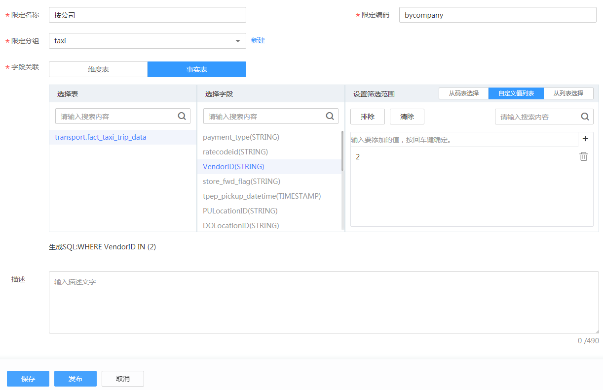

# 新建通用限定

原子指标是计算逻辑的标准化定义，通用限定则是条件限制的标准化定义。为保障所有统计指标统一、标准、规范地构建，通用限定在业务板块内唯一，并唯一归属于一个来源逻辑表，计算逻辑也以该来源逻辑表模型的字段为基础进行定义。由于一个通用限定的定义可能来自于归属不同数据域的多个逻辑表，因此一个通用限定可能归属于多个数据域。

## 新建通用限定并发布

在创建通用限定之前，请先确认您已完成维度表、事实表和限定分组的新建、发布与审核。

1.  [登录DAYU控制台](https://console.huaweicloud.com/dayu/)，找到所需要的DAYU实例，单击实例卡片上的“进入控制台”，进入概览页面。

    选择“空间管理”页签，完成工作空间的创建。

    在工作空间列表中，找到所需要的工作空间。

1.  单击相应工作空间的“规范设计“。

    系统跳转至规范设计页面。

1.  在规范设计页面，单击左侧导航树中的“维度建模“，选择“通用限定“页签。
2.  进入通用限定页面后，单击“新建“按钮。
3.  如下图所示配置通用限定，然后单击“发布“。

    **图 1**  通用限定  
    

    **表 1**  新建通用限定参数说明

    
    <table><thead align="left"><tr id="zh-cn_topic_0169427443_row85167201413"><th class="cellrowborder" valign="top" width="16.1%" id="mcps1.2.3.1.1">
参数名称

    </th>
    <th class="cellrowborder" valign="top" width="83.89999999999999%" id="mcps1.2.3.1.2">
说明

    </th>
    </tr>
    </thead>
    <tbody><tr id="zh-cn_topic_0169427443_row175163215142"><td class="cellrowborder" valign="top" width="16.1%" headers="mcps1.2.3.1.1 ">
限定名称

    </td>
    <td class="cellrowborder" valign="top" width="83.89999999999999%" headers="mcps1.2.3.1.2 ">
只能包含中文、英文字母、数字和下划线，且以中文或英文字母开头。

    </td>
    </tr>
    <tr id="zh-cn_topic_0169427443_row1516202121414"><td class="cellrowborder" valign="top" width="16.1%" headers="mcps1.2.3.1.1 ">
限定编码

    </td>
    <td class="cellrowborder" valign="top" width="83.89999999999999%" headers="mcps1.2.3.1.2 ">
只能包含英文字母、数字和下划线，且以英文字母开头。

    </td>
    </tr>
    <tr id="zh-cn_topic_0169427443_row1051682141415"><td class="cellrowborder" valign="top" width="16.1%" headers="mcps1.2.3.1.1 ">
限定分组

    </td>
    <td class="cellrowborder" valign="top" width="83.89999999999999%" headers="mcps1.2.3.1.2 ">
根据下拉框选择对应的限定分组。

    </td>
    </tr>
    <tr id="zh-cn_topic_0169427443_row25174214149"><td class="cellrowborder" valign="top" width="16.1%" headers="mcps1.2.3.1.1 ">
字段关联

    </td>
    <td class="cellrowborder" valign="top" width="83.89999999999999%" headers="mcps1.2.3.1.2 ">
根据实际情况选择需要的字段关联，并设置筛选范围。

    
设置筛选范围可以选择以下3种方式，：

    <ul id="zh-cn_topic_0169427443_ul178961850249"><li>从码表选择：可以从已创建的码表中，选择所需要的值。</li><li>自定义值列表：可以添加一个或多个自定义值。</li><li>从列表选择：从现有的值中选择一个或多个值。</li></ul>
    
单击，设置需要排除的筛选范围，即在生成的SQL语句中显示为NOT IN，再次单击取消排除的筛选范围，即在生成的SQL语句中还原为IN。

    </td>
    </tr>
    <tr id="zh-cn_topic_0169427443_row1351713214143"><td class="cellrowborder" valign="top" width="16.1%" headers="mcps1.2.3.1.1 ">
描述

    </td>
    <td class="cellrowborder" valign="top" width="83.89999999999999%" headers="mcps1.2.3.1.2 ">
描述信息。支持的长度0~490个字符

    </td>
    </tr>
    </tbody>
    </table>

4.  在弹出框中单击“确认提交”，提交发布审核。
5.  （可选）参照[5](#li151389471681)\~[8](#li613934715819)的步骤，完成其他通用限定的新建和发布。
6.  等待审核人员审核。

    审核通过后，时间限定就创建好了。

## 管理通用限定

1.  在规范设计页面，单击左侧导航树中的“维度建模“，选择“通用限定“页签，进入通用限定页面。

    **图 2**  通用限定页面  
    

2.  您可以根据实际需要选择如下操作。

    
    <table><thead align="left"><tr id="zh-cn_topic_0169427443_row167461051211"><th class="cellrowborder" valign="top" width="37.9%" id="mcps1.1.3.1.1">
当需要...

    </th>
    <th class="cellrowborder" valign="top" width="62.1%" id="mcps1.1.3.1.2">
则...

    </th>
    </tr>
    </thead>
    <tbody><tr id="zh-cn_topic_0169427443_row1674695011"><td class="cellrowborder" valign="top" width="37.9%" headers="mcps1.1.3.1.1 ">
新建

    </td>
    <td class="cellrowborder" valign="top" width="62.1%" headers="mcps1.1.3.1.2 ">
执行<a href="#zh-cn_topic_0169427443_section873212219130">新建通用限定并发布</a>。

    </td>
    </tr>
    <tr id="zh-cn_topic_0169427443_row137468516113"><td class="cellrowborder" valign="top" width="37.9%" headers="mcps1.1.3.1.1 ">
编辑

    </td>
    <td class="cellrowborder" valign="top" width="62.1%" headers="mcps1.1.3.1.2 ">
执行<a href="#li4661179257">3</a>。

    </td>
    </tr>
    <tr id="zh-cn_topic_0169427443_row1746651110"><td class="cellrowborder" valign="top" width="37.9%" headers="mcps1.1.3.1.1 ">
发布

    </td>
    <td class="cellrowborder" valign="top" width="62.1%" headers="mcps1.1.3.1.2 ">
执行<a href="#li186616719258">4</a>。

    </td>
    </tr>
    <tr id="zh-cn_topic_0169427443_row195105118312"><td class="cellrowborder" valign="top" width="37.9%" headers="mcps1.1.3.1.1 ">
下线

    </td>
    <td class="cellrowborder" valign="top" width="62.1%" headers="mcps1.1.3.1.2 ">
执行<a href="#li10661187112518">5</a>。

    </td>
    </tr>
    <tr id="zh-cn_topic_0169427443_row9597213538"><td class="cellrowborder" valign="top" width="37.9%" headers="mcps1.1.3.1.1 ">
删除

    </td>
    <td class="cellrowborder" valign="top" width="62.1%" headers="mcps1.1.3.1.2 ">
执行<a href="#li14661178257">6</a>。

    </td>
    </tr>
    </tbody>
    </table>

3.  编辑
    1.  在需要编辑的通用限定右侧，单击右侧“编辑“，进入编辑通用限定页面。
    2.  参见[2](#li86583711252)，根据实际需要编辑相关内容。
    3.  单击“保存“，保存该通用限定信息；或者单击“发布“，发布该通用限定信息。

4.  发布
    1.  在需要发布的通用限定右侧，单击“发布“，弹出“提交发布“对话框。
    2.  在下拉菜单中选择审核人。
    3.  单击“确定提交“。

5.  下线
    1.  在需要下线的通用限定右侧，单击右侧“下线“，系统弹出“提交下线“对话框。
    2.  在下拉菜单中选择审核人。
    3.  单击“确认提交“。

        > **说明：**   
        >1.  下线及删除通用限定的前提是无依赖引用，即复合指标引用。  

6.  删除
    1.  勾选需要删除的通用限定，单击左上角“删除“，系统弹出“删除“对话框。
    2.  单击“确定“。

