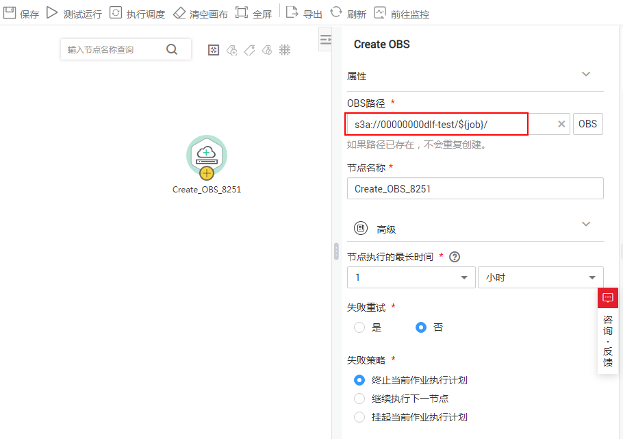

# 环境变量

本章节主要介绍环境变量的配置和使用。

## 操作步骤

1.  在数据开发主界面的左侧导航栏，选择“配置“。
2.  单击“环境变量“，在“环境变量配置“页面，配置如[表1](#zh-cn_topic_0175328117_table15478104515569)所示的参数，单击“保存“。

    **图 1**  环境变量配置  
    

    **表 1**  环境变量参数配置

    
    <table><thead align="left"><tr id="zh-cn_topic_0175328117_row12479445145617"><th class="cellrowborder" valign="top" width="25%" id="mcps1.2.4.1.1">
参数

    </th>
    <th class="cellrowborder" valign="top" width="12%" id="mcps1.2.4.1.2">
是否必选

    </th>
    <th class="cellrowborder" valign="top" width="63%" id="mcps1.2.4.1.3">
说明

    </th>
    </tr>
    </thead>
    <tbody><tr id="zh-cn_topic_0175328117_row1747910456567"><td class="cellrowborder" valign="top" width="25%" headers="mcps1.2.4.1.1 ">
参数名称

    </td>
    <td class="cellrowborder" valign="top" width="12%" headers="mcps1.2.4.1.2 ">
是

    </td>
    <td class="cellrowborder" valign="top" width="63%" headers="mcps1.2.4.1.3 ">
只支持英文字母、数字、“-”、“_”，最大长度为64字符，且参数名称不允许重名。

    </td>
    </tr>
    <tr id="zh-cn_topic_0175328117_row16480945135620"><td class="cellrowborder" valign="top" width="25%" headers="mcps1.2.4.1.1 ">
参数值

    </td>
    <td class="cellrowborder" valign="top" width="12%" headers="mcps1.2.4.1.2 ">
是

    </td>
    <td class="cellrowborder" valign="top" width="63%" headers="mcps1.2.4.1.3 ">
参数值当前支持常量和EL表达式，不支持系统函数。例如支持123，abc。

    
关于EL表达式的使用，请参见<a href="表达式概述.md">表达式概述</a>。

    </td>
    </tr>
    </tbody>
    </table>

    配置完一个环境变量后，您还可以进行新增，修改，删除等操作。

    -   新增：单击“新增“配置新的环境变量。
    -   修改：参数值为常量时，直接在文本框中修改参数值；参数值为EL表达式时，可以单击文本框后方的编辑EL表达式，修改参数值。修改完成后，请“保存“。
    -   删除：在参数值文本框后方，单击删除环境变量。

## 使用方法

当前配置好的环境变量支持如下两种使用方法：

1.  $\{环境变量名\}
2.  \#\{Evn.get\(“环境变量名”\)\}

## 操作示例

背景信息：

-   在DLF系统中已创建一个作业“test“
-   在环境变量中已新增一个变量，“参数名“为“job“，“参数值“为“123“。

1.  打开作业“test“，从左侧节点库中拖拽一个“Create OBS“节点。
2.  在节点属性页签中配置属性。

    **图 2**  Create OBS  
    

3.  单击“保存“后，选择“前往监控“页面监控作业的运行情况。

