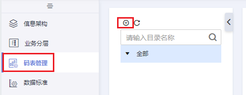
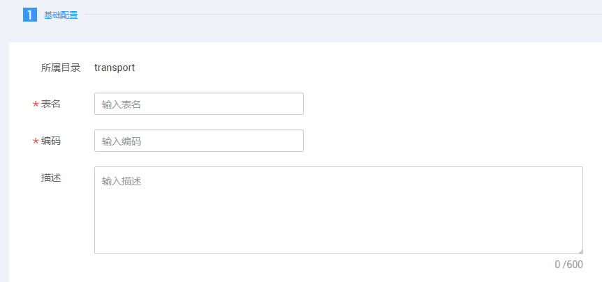

# 码表管理

码表，也称lookup表、数据字典表，一般由中英文名称编码组成，由可枚举数据的构成，存储枚举数据名称与编码的映射关系。码表的作用主要有：

-   在数据清洗中用于标准化业务数据以及补充映射字段。
-   在质量监控中用于监控业务数据的值域范围。
-   在维度建模中可以引申为枚举维度。

本章节介绍以下内容：

-   [新建码表并发布](#zh-cn_topic_0189613897_section674893915138)

    手动新建码表，完成新建后可以参考[填写数值](#section1775021114542)添加码表记录。

-   [导入码表](#zh-cn_topic_0189613897_section722576328)

    通过导入码表，可以导入新的码表，也可以往已有的码表中批量导入码表记录。如果码表记录比较多，建议采用导入方式。

-   [管理码表](#zh-cn_topic_0189613897_section1941514304119)

    建立好码表后，可以对码表进行查找、编辑或删除操作。

## 新建码表并发布

1.  [登录DAYU控制台](https://console.huaweicloud.com/dayu/)，找到所需要的DAYU实例，单击实例卡片上的“进入控制台”，进入概览页面。

    选择“空间管理”页签，完成工作空间的创建。

    在工作空间列表中，找到所需要的工作空间。

1.  单击相应工作空间的“规范设计“。
2.  在规范设计页面，单击左侧导航树中的“码表管理“。
3.  在“码表管理“页面，单击按钮新建目录，如下图所示。

    **图 1**  码表管理页面  
    

4.  在弹出窗口中配置如下参数，然后单击“确定“。

    **图 2**  新建码表目录  
    

    **表 1**  参数描述

    
    <table><thead align="left"><tr id="zh-cn_topic_0189613897_row1667010516314"><th class="cellrowborder" valign="top" width="19.96%" id="mcps1.2.3.1.1">
参数名称

    </th>
    <th class="cellrowborder" valign="top" width="80.04%" id="mcps1.2.3.1.2">
说明

    </th>
    </tr>
    </thead>
    <tbody><tr id="zh-cn_topic_0189613897_row76702511632"><td class="cellrowborder" valign="top" width="19.96%" headers="mcps1.2.3.1.1 ">
目录名称

    </td>
    <td class="cellrowborder" valign="top" width="80.04%" headers="mcps1.2.3.1.2 ">
只能包含中文、英文字母、数字和下划线。

    </td>
    </tr>
    <tr id="zh-cn_topic_0189613897_row7670195110319"><td class="cellrowborder" valign="top" width="19.96%" headers="mcps1.2.3.1.1 ">
选择目录

    </td>
    <td class="cellrowborder" valign="top" width="80.04%" headers="mcps1.2.3.1.2 ">
在已有的目录中选择一个目录，新建的目录将创建在所选择的目录中。

    </td>
    </tr>
    </tbody>
    </table>

5.  在目录树中单击刚建好的目录，然后单击“新建“按钮新建一个码表。
6.  在弹出对话框中，做如下配置：

    填写基础配置参数，然后单击“下一步“：

    **图 3**  基础配置  
    

    **表 2**  基础配置

    
    <table><thead align="left"><tr id="zh-cn_topic_0189613897_row197762036123115"><th class="cellrowborder" valign="top" width="19.96%" id="mcps1.2.3.1.1">
参数名称

    </th>
    <th class="cellrowborder" valign="top" width="80.04%" id="mcps1.2.3.1.2">
说明

    </th>
    </tr>
    </thead>
    <tbody><tr id="zh-cn_topic_0189613897_row27761336103113"><td class="cellrowborder" valign="top" width="19.96%" headers="mcps1.2.3.1.1 ">
表名

    </td>
    <td class="cellrowborder" valign="top" width="80.04%" headers="mcps1.2.3.1.2 ">
表的中文名称。只能包含中文、英文字母、数字、左右括号、空格、中划线和下划线，且以中文或英文字母开头。

    </td>
    </tr>
    <tr id="zh-cn_topic_0189613897_row677633619314"><td class="cellrowborder" valign="top" width="19.96%" headers="mcps1.2.3.1.1 ">
编码

    </td>
    <td class="cellrowborder" valign="top" width="80.04%" headers="mcps1.2.3.1.2 ">
表的英文名称。只能包含英文字母、数字、左右括号、空格、中划线和下划线，且以英文字母开头。

    </td>
    </tr>
    <tr id="zh-cn_topic_0189613897_row1578653953215"><td class="cellrowborder" valign="top" width="19.96%" headers="mcps1.2.3.1.1 ">
描述

    </td>
    <td class="cellrowborder" valign="top" width="80.04%" headers="mcps1.2.3.1.2 ">
描述信息。支持的长度0~600字符。

    </td>
    </tr>
    </tbody>
    </table>

    在建表配置中添加所需要的表字段，单击可以添加新的字段：

    **图 4**  建表配置  
    

7.  单击“发布“，选择审核人，再单击“确认提交”提交审核。

    等待审核人员审核通过。审核通过后，码表在数据库中就建好了。返回“码表管理”页面，在列表中可以查看建好的码表。

## 填写数值

对于已创建的码表，您可以通过填写数值，增加码表记录。

1.  在规范设计页面，单击左侧的“码表管理“，进入码表管理页面。
2.  在码表列表，找到所需要的码表，单击其所在行的“更多 \> 填写数值”。
3.  进入相应页面后，单击“新建”，并在弹出窗口中设置各字段的值。

    **图 5**  填写数值  
    

4.  完成后单击“确定”。或者您也可以单击“确定并继续”继续添加更多码表记录。

## 导入码表

通过导入码表，可以导入新的码表，也可以往已有的码表中批量导入码表记录。如果码表记录比较多，建议采用导入方式。

1.  在规范设计页面，单击左侧的“码表管理“，进入码表管理页面。
2.  在左侧的目录树中，选择做需要的目录，再单击“导入“，弹出对话框，如下图所示：

    **图 6**  导入码表  
    

3.  单击“下载码表导入模板”，下载到如下所示的模板，请根据业务需求填写好模板中的相关参数并保存：

    **表 3**  码表导入模板

    
    <table><thead align="left"><tr id="zh-cn_topic_0189613897_row693710107516"><th class="cellrowborder" valign="top" width="33.33333333333333%" id="mcps1.2.4.1.1">
编码

    
code

    </th>
    <th class="cellrowborder" valign="top" width="33.33333333333333%" id="mcps1.2.4.1.2">
值

    
value

    </th>
    <th class="cellrowborder" valign="top" width="33.33333333333333%" id="mcps1.2.4.1.3">
描述

    
description

    </th>
    </tr>
    </thead>
    <tbody><tr id="zh-cn_topic_0189613897_row1393761010515"><td class="cellrowborder" valign="top" width="33.33333333333333%" headers="mcps1.2.4.1.1 ">&nbsp;&nbsp;</td>
    <td class="cellrowborder" valign="top" width="33.33333333333333%" headers="mcps1.2.4.1.2 ">&nbsp;&nbsp;</td>
    <td class="cellrowborder" valign="top" width="33.33333333333333%" headers="mcps1.2.4.1.3 ">&nbsp;&nbsp;</td>
    </tr>
    </tbody>
    </table>

    在导入模板中，添加码表记录，完成后保存模板文件。

    填写说明：

    -   如果要导入多个码表，可以在模板文件中添加多个Sheet页，Sheet页的名称即为码表名称。
    -   如果码表名称已存在，导入时会更新已有的码表。
    -   如果码表名称不存在，导入时会新建该码表。

4.  返回“导入码表”的页面，选择上一步配置好的码表导入模板文件，然后单击“上传并校验“。

    如果上传的模板文件校验不通过，请修改正确后，再重新上传。

5.  单击“确定“完成码表的导入。

## 管理码表

1.  在规范设计页面，单击左侧的“码表管理“，进入码表管理页面。
2.  在码表列表中，可以执行以下操作：

    -   **新建**

        详情请参见[新建码表并发布](#zh-cn_topic_0189613897_section674893915138)

    -   **导入**

        详情请参见[导入码表](#zh-cn_topic_0189613897_section722576328)。

    -   **导出**

        在码表列表上方，单击“导出“，并在弹出框中选择导出对象再单击“确定“，即可导出指定的码表。

    -   **编辑**

        在码表列表中，找到所需要的码表，单击其所在行的“编辑“，即可编辑指定的码表。

    -   **发布**

        在码表列表中，对于状态为“草稿”或“已驳回”的码表，单击其所在行的“发布“，并在弹出框中选择审核人并单击“确认提交”，即可发布该码表提交审核。等待审核人员审核通过后，码表就发布成功了。

    -   **填写数值**

        在码表列表中，找到所需要的码表，单击其所在行的“更多 \> 填写数值“，跳转到相应页面后，单击“新建“并填写相关字段即可添加码表记录。可以添加多条记录，添加完成后，单击“保存“或“发布“。

    -   **下线**

        在码表列表中，找到所需要的状态为“已发布”的码表，单击其所在行的“下线“，并在弹出框中选择审核人并单击“确认提交”，即可提交下线申请。等待审核人员审核通过后，码表就下线成功了。

    **图 7**  码表管理  
    

